# Chapter 01：為什麼視訊通話不是「把影片寄過去」

## 1. 今天遇到什麼問題？

小明按下視訊通話按鈕時，畫面不一定立刻出現。有時他先看到自己，過一會兒才看到小華；有時影像出現了，聲音卻沒有；還有時兩邊原本聊得很順，幾分鐘後畫面忽然停住。

如果視訊通話只是「把影片寄過去」，事情似乎不該這麼麻煩。小明先錄完一段影片，等檔案準備好，再交給小華。小華收到完整檔案後按下播放，就能從頭看到尾。這和傳送一張照片很像：內容先完成，接著才傳送，收完之後再觀看。

可是通話時，小華不想等小明講完十分鐘、收完一個完整檔案，才回答第一句話。她會在聽見問題後立刻回應；小明也會看著她的表情改變說法。新的聲音與畫面一直在產生，雙方也一直在接收和回應。等待如果太久，兩個人就會搶話、停頓，甚至以為對方沒有聽見。

因此，視訊通話的核心不是「把一份完成的影片交出去」，而是讓雙方能在內容持續產生時，持續交換資訊並互相回應。這件事至少留下六個待解問題：當下的聲音與畫面從哪裡來？雙方怎麼交換準備通話所需的協調資訊？資料怎麼找到能到達對方的方式？通話內容與協調資訊怎麼受到保護？正在產生的聲音與畫面怎麼持續送出？網路情況改變時，互動品質怎麼盡量維持？

這六問現在只是全書地圖，不是六個已經解開的答案。它們也不一定照順序發生；真實通話中，多件事可能交錯或同時進行。本章的任務，是先看清問題的形狀。

## 2. 生活故事

小明準備和小華討論隔天的科展報告。他想到一個簡單方法：「我先把想說的話錄成影片，再把影片寄給你。」

第一段影片錄了三分鐘。小明錄完、檢查完，再交給小華。小華看完後才發現，她在第一分鐘就有問題：「你說的測量結果，是星期一還是星期二的？」於是她再錄一段影片回覆。等小明收到，兩人已經花了不少時間，卻還停在第一個問題。

「如果我在你說到第一分鐘時就能問呢？」小華說。

兩人改成持續對話。小明說到日期時，小華立刻追問；小明聽見後馬上修正。小華拿起一張圖，小明也能當場指出哪個數字需要重算。這次，資訊不是先做成一份完整作品才交付，而是在產生的同時不斷往返。

不過，他們很快又遇到新問題。小明的畫面出現了，不代表小華的聲音一定已經送達；小華看得到小明，也不代表小明看得到小華。兩人還得先知道彼此都準備好了、設法讓資料到達、避免內容被不相干的人看見，並在網路忽快忽慢時繼續交談。

這個「寄送完成影片」與「持續對話」的比喻，在一個範圍內成立：前者凸顯內容先完成再傳送，後者凸顯雙方邊產生、邊交換、邊回應，等待時間也會影響互動。

但比喻從這裡開始失真。真正的即時通訊不是小明和小華親手逐句搬運資訊，也不是沿著一條永遠不變的道路前進。瀏覽器會同時處理多種工作、狀態與回饋；故事中的「直接說話」也不能用來推論資料實際怎麼走。故事幫我們提出問題，不能代替真正的技術說明。

## 3. 如果你是工程師，你會怎麼解？

先別急著想某個產品名稱，也別猜要按哪個按鈕。假設你只能寫下一份「通話必須做到什麼」的清單，你會列哪些項目？

你可以先問：

1. **怎麼取得此刻的內容？** 雙方都要能取得當下的聲音；需要畫面時，也要取得當下的影像。
2. **怎麼確認雙方能合作？** 兩邊必須交換建立通話所需的協調資訊，而不是各自準備後就期待事情自動完成。
3. **怎麼讓資料到達？** 裝置可能位於不同環境，資料需要找到可用的到達方式。
4. **怎麼保護通話？** 建立通話所需的資訊，以及真正交換的聲音與畫面，都不能被當成毫無保護的公開內容。
5. **怎麼持續交換？** 內容尚未全部產生，系統就要讓已產生的部分持續前進，讓另一端能及時接收。
6. **情況變差時怎麼辦？** 可用條件可能隨時間改變，系統要盡量維持能互動的結果，而不是只在最理想的一刻成功。

這份清單刻意不回答「內部到底怎麼做」。它的價值是讓我們不會把某一個成功現象誤認成全部成功。例如，看到小華的畫面，只能證明「目前有一項可見現象」；它不能單獨證明小華聽得到小明、小明聽得到小華、兩邊畫面都正常、所有協調都正確，或品質接下來都不會改變。

工程師面對複雜系統時，常先把「想要的結果」和「支持結果的證據」分開。前者說明目標，後者幫助判斷哪些部分真的成立。本章不要求你解開六問，只要求你不要漏問。

## 4. 正式技術名稱

第一個名稱是**即時通訊（Real-Time Communication）**。在本書中，它指資訊產生後，在足以支援人類互動的時間內持續交換。重點是「持續」與「能互相回應」，不是保證完全沒有等待、永遠不失敗或品質固定不變。

第二個名稱是**網頁即時通訊（Web Real-Time Communication, WebRTC）**。WebRTC 提供一組標準化的瀏覽器能力與處理模型，讓瀏覽器及相容的一端能建立即時的聲音、畫面或資料通訊。本章只看全貌，不拆解內部做法。

WebRTC 不是一部萬能機器，也不是一種影片檔格式。它不代表只要出現一個按鈕，所有準備、協調、到達方式、安全與品質問題就會自動消失；它也不保證資料一定以某一種固定方式在兩部裝置之間移動。

第三個名稱是 **peer**，本書譯為**對等端**。Peer 是參與一次即時通訊的一端。在本章故事中，小明端和小華端各代表一個瀏覽器／peer 角色。

Peer 描述的是一次通訊中的角色，不等於一個人，也不等於一台永遠固定不變的機器。名稱裡的「對等」更不保證資料一定直接在兩部裝置之間傳送；真正的到達方式要在後續章節用證據判斷。

本章採用的 WebRTC 技術定位來自 W3C 於 2025 年 3 月 13 日發布的 WebRTC Recommendation。全書問題地圖也參考 2021 年 1 月發布的 RFC 8825；它的狀態是 Proposed Standard，屬於 Internet Standards Track。它是一份 applicability statement 與規範 roadmap，本身不另行定義 protocol。

## 5. 專有名詞小卡

以下三張都是本章提出的候選小卡；在本章所有審查完成前，它們還不會進入全書正式詞庫。

### 即時通訊

英文：Real-Time Communication  
中文：即時通訊  
一句話：資訊產生後，在足以支援互動的時間內持續交換  
生活比喻：小明說話時，小華不必等完整影片做完，就能聽見、理解並回應  
真正作用：描述一種重視持續交換與互動時間的通訊需求  
常見誤解：「即時」不代表完全零等待、永不失敗或品質永遠相同  
適用版本／範圍：本書的瀏覽器即時影音與資料通訊入門範圍  
首次出現章節：Chapter 01  
來源：<https://www.rfc-editor.org/rfc/rfc8825.html>

### WebRTC

英文：Web Real-Time Communication  
中文：網頁即時通訊  
一句話：讓瀏覽器與相容端點建立即時通訊所需的一組標準化能力與處理模型  
生活比喻：小明與小華要持續對話，需要一整套互相配合的準備與處理能力  
真正作用：支援瀏覽器建立即時聲音、畫面或資料通訊；本章只介紹整體定位  
常見誤解：WebRTC 不是單一設備、單一傳送規則、視訊檔格式，也不保證固定的資料到達方式  
適用版本／範圍：W3C WebRTC Recommendation，2025-03-13 版本；本書以瀏覽器情境為主  
首次出現章節：Chapter 01  
來源：<https://www.w3.org/TR/2025/REC-webrtc-20250313/>

### Peer

英文：Peer  
中文：對等端  
一句話：參與一次即時通訊的一端  
生活比喻：故事中的小明端與小華端各代表一個參與通話的角色  
真正作用：指出一次通訊中的參與端角色  
常見誤解：peer 不等於一個人或一台永久固定的機器，也不保證資料直接在兩台裝置之間傳送  
適用版本／範圍：本章用於描述瀏覽器／peer 角色；實際資料到達方式留待後章  
首次出現章節：Chapter 01  
來源：<https://www.w3.org/TR/2025/REC-webrtc-20250313/>

## 6. 第一張圖：生活故事圖

本章的第一張圖要幫你比較兩條時間線。

**圖 1-1　完成檔案寄送與持續雙向互動的時間差。**上列必須先準備並交付完整影片，小華之後才能觀看與回應；下列則在內容持續產生時交錯交換與回應。文字箭頭只表示故事中的互動節奏，不表示真實資料路徑。

第一條是「完整影片寄送」：小明先把內容全部準備完成，接著交出完整影片，小華收到後才開始觀看與回應。時間線上會有明顯的「準備完畢」界線。

第二條是「持續對話」：小明與小華產生的聲音、畫面和回應交錯出現。兩人不需要等一方完成整段內容，才開始另一方的回應。

讀圖時只要抓住一件事：**完成檔案的傳送以內容先完成為前提；即時互動則在內容持續產生時就持續交換。**

這張生活圖不表示真正的技術架構，也不表示資料沿固定道路移動。圖中的人、片段與時間線只是用來比較互動節奏；不能拿來判斷通話內部使用了哪些元件，或資料實際經過哪裡。

## 7. 第二張圖：專業圖

第二張圖是全書的最小鳥瞰圖。左邊是 Browser A（小明端），右邊是 Browser B（小華端）。兩端之間只畫兩種概念性的交換：

**圖 1-2　WebRTC 通話的最小概念鳥瞰。**Browser A（小明端）與 Browser B（小華端）之間分列協調資訊與即時影音兩種概念交換；中央文字箭頭只區分用途並提醒雙方都需交換，不表示直接傳送、實際拓撲、資料路徑或內部實作。

- **協調資訊：**雙方為建立通話而需要交換的資訊。
- **即時影音：**通話進行時持續交換的聲音與畫面。

兩種線都必須是雙向概念，提醒我們不能只檢查一邊。但箭頭不代表真正的連線方向、經過哪些設備或使用哪種傳送方式。圖中也會保留「細節於後章拆解」的標記。

這張圖的目的，是先把「建立通話所需的交換」和「通話中的聲音與畫面」分開看。它不是完整架構，更不能由兩個瀏覽器之間的一條線推論資料一定直接傳送。

## 8. 流程、狀態或資料怎麼走？

現在把六個問題排成方便閱讀的提問地圖。請注意，這不是一條固定的單向流水線；通話期間，某些工作會同時進行，也可能因情況改變而再次處理。

### 提問一：如何取得當下內容？

雙方要先有「現在」的聲音與畫面可供交換。若只拿到小明之前錄好的影片，得到的是可播放內容，卻不是正在發生的互動。

### 提問二：如何交換協調資訊？

小明端準備好了，不代表小華端自動知道。雙方需要交換足以建立通話的協調資訊。本章只知道「需要交換」，不討論資訊格式與交換方法。

### 提問三：如何找到能到達的方式？

兩端可能位於不同環境。系統需要找出資料能否到達，以及目前可採用什麼方式。這個問題不能靠故事中兩人「面對面」的畫面回答。

### 提問四：如何保護交換內容？

通話不是公開廣播。建立通話所需的資訊，以及雙方交換的聲音與畫面，都有安全需求。本章不把「保護」綁定為某一種特定做法，也不聲稱只靠一個圖示就能證明安全。

### 提問五：如何持續送出正在產生的內容？

新的內容會一小段一小段持續出現。接收的一端也要持續處理，而不是等待一個永遠還沒錄完的完整檔案。

### 提問六：如何面對條件改變？

網路情況、裝置負擔或使用者操作都可能改變可見結果。系統要盡量維持互動；工程師則需要觀察改變前、改變中與恢復後的證據。

這六問共同描述了「視訊通話為什麼比寄影片複雜」。任何一問都不是完整通話的同義詞，任何單一成功現象也不能替其餘五問作證。

## 9. 最小實作或最小可觀察練習

本章還沒有教授足以安全寫出 WebRTC 程式的內容，因此**沒有正式 Lab，也不寫程式**。我們先練習一件更基礎的工程能力：把「我覺得通了」改寫成可逐項觀察的結果。

請準備下面的觀察表。若沒有安全的自有測試環境，直接使用表後的紙上情境，學習成果完全相同。

| 觀察項目 | 正常時 | 自己 mute 後 | unmute 恢復後 |
|---|---|---|---|
| 小明是否聽見小華 | 有／無／未知 | 有／無／未知 | 有／無／未知 |
| 小華是否聽見小明 | 有／無／未知 | 有／無／未知 | 有／無／未知 |
| 小明是否看見小華 | 有／無／未觀察 | 有／無／未觀察 | 有／無／未觀察 |
| 小華是否看見小明 | 有／無／未觀察 | 有／無／未觀察 | 有／無／未觀察 |
| 小明端的 mute 指示 | 開／關／未知 | 開／關／未知 | 開／關／未知 |
| 從操作到對端察覺是否需等待 | 幾乎立即／有等待／未觀察 | 幾乎立即／有等待／未觀察 | 幾乎立即／有等待／未觀察 |
| 品質是否有明顯變化 | 無／有／未觀察 | 無／有／未觀察 | 無／有／未觀察 |
| 是否恢復到原本可互動狀態 | 尚未測試 | 尚未恢復 | 是／否／未知 |

紙上情境如下：正常時，小明與小華都聽得到對方，也都看得到對方。小明按下自己畫面上的 mute 按鈕後，小明端顯示已 mute；小華不再聽到小明，但小明仍聽得到小華，原本可見的雙方畫面也仍存在。小明按下 unmute 後，小華再次聽到小明的測試短句。請把這些現象填入表格，沒有提供的資訊一律寫「未知」，不要猜。

「未知」不是失敗答案。它是在提醒你：沒有觀察，就沒有足夠證據下結論。

## 10. 動手做

這是可選的章內觀察，不是正式 Lab。只有符合下列條件才操作：兩部裝置都由你擁有或控制；兩個測試帳號都是自己的；通話不是課堂、家庭、工作或其他正在使用的會議；沒有其他參與者；不開啟錄影或錄音。若任一條不成立，改做上一節的紙上情境。

為避免刺耳回授，兩部裝置不要把喇叭和麥克風靠在一起；優先使用耳機，或把音量維持在舒適的低音量。

1. 在兩部自有裝置上建立一場只含兩個自有測試帳號的通話。
2. 確認兩端介面都顯示自己未 mute。
3. 小明說一句不含個資的測試短句，例如「測試一、二、三」；小華確認是否聽見。
4. 小華也說一句測試短句；小明確認是否聽見。
5. 若兩端原本就有畫面，只記錄「有」或「無」，不要截圖或保存內容。
6. 把結果填入觀察表的「正常時」欄。沒有親自觀察的項目寫「未觀察」或「未知」。

預期的正常基準是：兩端都顯示未 mute，兩端都能聽見對方；若選擇觀察畫面，則分別記錄兩個方向是否看得見。這個基準是等等判斷故障與恢復的比較點。

遇到以下任一情況就立即停止：出現非測試參與者、產品開始錄製、要求付費、帳號或裝置不是自己控制，或發生刺耳回授、身體不適、裝置明顯過熱。停止後結束通話；不要為了完成表格而降低安全條件。

## 11. 故意把它弄壞

接下來只製造一個很小、可復原的故障：**小明按下產品原本就有的 mute 按鈕，暫停自己的麥克風聲音。**

不要關閉網路，不要修改瀏覽器或裝置的權限，不要改動系統聲音設定，不要關閉攝影機，也不要操作小華端。一次只改一件事，才知道觀察到的變化和哪個操作有關。

操作後記錄：

1. 小明端是否明確顯示自己已 mute。
2. 小華是否不再聽到小明的測試短句。
3. 小明是否仍聽得到小華。
4. 原本存在的畫面是否仍然可見；若未觀察，就填「未觀察」。
5. 從按下按鈕到小華察覺之間，是否有明顯等待。

預期證據是「小明端顯示已 mute，而且小華不再聽到小明」。這些證據只支持一個有限結論：小明的聲音輸出因使用者操作而暫停。它不能證明 WebRTC 內部哪個部分改變，也不能證明整場通話、所有方向的聲音、所有畫面或所有安全需求同時成功或失敗。

若按鈕的影響不清楚、產品出現錄製、非測試參與者加入，或發生任何前一節的停止條件，立即結束操作並改用紙上情境。

## 12. 工程師 Debug

Debug 不是看到「沒聲音」就立刻猜內部原因，而是先縮小可以由證據支持的範圍。

第一步，看小明自己的介面。若顯示已 mute，表示有一項直接可見的使用者狀態。第二步，請小華確認她失去的是不是只有「從小明而來的聲音」。若小明仍聽得到小華，而原本的畫面也仍存在，就不能把現象說成「整場通話完全斷掉」。

第三步，恢復唯一改動：小明按下 unmute。小明先確認自己的介面回到未靜音，再說同一句測試短句；小華確認是否重新聽見。把結果記入「unmute 恢復後」欄。

如果聲音恢復，我們可以說：「移除小明端的 mute 狀態後，小華再次聽見小明，觀察結果回到正常基準。」仍然不能由此推論通話內部每個部分都已被檢查。

如果聲音沒有恢復，不要任意修改尚未學過的設定。把結果標為「未恢復／原因未知」，接著安全結束測試。誠實保留未知，比一次改動很多項目後猜測原因更有價值。

最後完成 cleanup：正常結束通話，關閉使用中的測試分頁或應用，必要時登出臨時測試帳號；確認麥克風與攝影機的使用指示已熄滅。不要留下錄製檔、截圖、通話連結或個資。恢復驗證只記兩件事：unmute 後聲音是否回來，以及通話結束後裝置是否不再被使用。

這次練習呈現了一個重要原則：症狀的範圍、證據的範圍和結論的範圍要一致。小華聽不到小明，不等於所有問題都壞了；一個方向恢復，也不等於所有問題都已驗證。

## 13. 本章一句話

視訊通話是持續的雙向互動，必須同時面對多類問題，不能只當成寄送一份已完成的影片。

## 14. 五題理解題

### 第 1 題

為什麼「先錄完影片再寄送」不適合描述一場自然對話？

**答案解析：**因為自然對話需要雙方在內容持續產生時就接收並回應；若等一方完成整段影片，另一方才能回答，等待會破壞互動。差異不只是影片長短，而是「先完成再傳送」和「邊產生邊交換」兩種模式。

### 第 2 題

不使用後章技術名稱，列出本章的六類待解問題。

**答案解析：**取得當下的聲音與畫面、交換建立通話所需的協調資訊、找到資料能到達的方式、保護協調資訊與通話內容、持續傳送正在產生的影音，以及在條件改變時盡量維持互動品質。六項可能交錯發生，不是固定的單一路線。

### 第 3 題

小明端和小華端都是 peer。這能不能證明資料一定直接在兩部裝置之間傳送？為什麼？

**答案解析：**不能。Peer 只描述參與一次即時通訊的一端角色，沒有指定資料實際採用哪種到達方式。要判斷資料怎麼走，需要後續章節的知識與證據，不能從名稱或故事畫面推論。

### 第 4 題

小明看得到小華的畫面。為什麼這還不足以宣稱「通話全部成功」？

**答案解析：**因為這只是一個方向的一項可見現象。它沒有證明小華也看得到小明、雙方都聽得到彼此、協調資訊都正確、內容受到適當保護，或品質接下來都能維持。結論不能超過實際觀察到的證據。

### 第 5 題

小明按下 mute 後，小明端顯示已 mute，而且小華不再聽到小明；unmute 後聲音恢復。這些證據能證明什麼？又不能證明什麼？

**答案解析：**它們支持「小明的聲音輸出因使用者操作而暫停，移除該操作後可見結果回到基準」。它們不能證明 WebRTC 內部是哪個部分改變，也不能證明所有聲音、畫面、協調、安全與品質都正常。這正是讓證據範圍與結論範圍一致。

## 本章參考資料

- [WebRTC: Real-Time Communication in Browsers](https://www.w3.org/TR/2025/REC-webrtc-20250313/) — W3C Recommendation，2025-03-13；查核日期 2026-08-12；支援 WebRTC 是瀏覽器即時通訊的一組標準化能力與處理模型，以及 peer 角色的整體定位。
- [RFC 8825: Overview: Real-Time Protocols for Browser-Based Applications](https://www.rfc-editor.org/rfc/rfc8825.html) — Proposed Standard（Internet Standards Track），2021-01；查核日期 2026-08-12；支援瀏覽器即時通訊的整體問題、互動需求與多項機制共同作用，並說明它是 applicability statement／規範 roadmap，本身不另行定義 protocol。
