# Chapter 02：Client、Server、IP、Port、LAN 與 WAN

## 1. 今天遇到什麼問題？

上一章留下了一個問題：兩個 peer 都準備交換資訊時，資料究竟要送到哪裡？只知道「送給小華」還不夠，因為網路不會把人的姓名直接當成目的地。

今天，小明用瀏覽器向校內服務取得一個簡單頁面。他已經找到提供服務的裝置，卻仍然打不開頁面。奇怪的是，同一台裝置上的另一項服務可以正常使用。這表示「找到裝置」和「找到裝置上的特定服務」是兩個不同問題。

要描述最小的通訊情境，我們至少要回答五件事：這次是誰要求服務、誰提供服務、資料要去的網路位置、該位置上的哪個服務入口，以及資料會在什麼範圍的網路中前進。網路處理資料時，也不會把一整部影片或整份網站視為不可分割的一塊，而是處理有邊界的資料單位。

本章會建立「角色、位址、服務入口、網路範圍、資料單位」的心智模型。不過，看到一個頁面成功或失敗，仍只能支持同樣範圍的結論。這正是上一章學過的證據紀律：一項現象不能替整個網路或整套 WebRTC 作證。

## 2. 生活故事

小明要把一份校務文件交到行政大樓。他只在信封上寫「行政大樓」，文件送到大樓後，工作人員卻不知道該交給註冊組、出納組，還是設備組。

小華提醒他：「你需要兩項資訊。大樓地址告訴你要到哪個位置，辦公室入口則告訴你要找哪項服務。」小明補上「註冊組服務入口」，文件才有明確的概念目的地。

這次故事先幫我們建立「提出要求」與「提供結果」的直覺；正式角色只限稍後的 localhost HTTP connection。假設小華開啟小明在自己電腦上建立的測試頁面，小華的程式建立這條 connection，小明的程式接受它。換一條 connection，同一程式也可能交換角色。小明和小華不是天生固定的兩種角色，而且本章不把這項 HTTP 定義泛化到所有通訊方式。

如果文件只在一棟建築等相對有限的區域內傳遞，可以先建立局部範圍的尺度直覺。若要送往更大的地理範圍，並連接更多獨立使用者，則能建立廣域互連的尺度直覺。差異不能只用公尺數決定：來源沒有給出一條適用所有情境的距離門檻，故事中的校園線或行政線也不能代替真實網路分類。

「地址＋辦公室入口」的比喻成立在這裡：地址幫助我們區分網路位置，入口幫助我們區分同一位置上的不同服務；一次一份、有邊界的文件，也能幫助理解網路會處理有限的資料單位。

但比喻從這裡開始失真。網路位址不是人的姓名或永久門牌；在 IPv6 範圍，位址配給介面，單一介面可有多個位址，而使用自動設定的位址還有生命週期。這些限定例子都不能外推為所有位址使用相同機制。服務入口不是摸得到的洞，也不是應用程式本身。資料單位更不等於有簽收保證的信件：它可能沒到、較晚到、順序改變或重複。真實資料路徑也不必等於地圖上最短的道路。本章故事只建立直覺，不解釋資料實際如何選路。

## 3. 如果你是工程師，你會怎麼解？

面對「裝置找到了，服務卻找不到」時，先別把整個網路判定為故障。你可以把問題拆成四組。

第一組是**互動角色**。先把問題限定在本章的 localhost HTTP 情境，再指定正在觀察哪一條 connection：哪一方建立它？哪一方接受它？如果換了另一條 connection，同一程式的角色可能交換；這不是所有通訊方式的通用定義。

第二組是**位置與入口**。用一個欄位描述網路位置，再用另一個欄位描述該位置上的服務入口。只有位置，可能到達裝置卻找錯服務；只有入口數字，也無法單獨指出全球哪個位置。

第三組是**網路範圍**。比較兩個環境時，可先區分相對有限的區域，以及通常較大地理範圍、服務更多獨立使用者的互連情境；不要自行畫出一條公尺門檻。

第四組是**資料單位與證據**。資料被分成可處理的有限單位，不代表每個單位都一定準時、依序且只出現一次。觀察某一個服務入口失敗，也不能直接推論整台裝置、整個局部網路、整個跨範圍網路或 WebRTC 都失效。

這樣拆分後，我們得到的不是所有網路問題的答案，而是一份可檢查的最小清單：角色是否判斷正確？位置是否正確？入口是否正確？服務是否正在該入口等待？觀察到的證據究竟能支持多大的結論？

## 4. 正式技術名稱

先看互動角色，而且嚴格限定在本章的 localhost HTTP 情境。依 RFC 9110 §3.3，建立一條 HTTP connection 的參與者是**用戶端（client）**；接受該 connection 的參與者是**伺服器（server）**。角色依這一條 connection 判定，不是兩種永久固定的機器。同一程式可在不同 HTTP connection 中交換角色；本章不把這項定義泛化為所有通訊方式。

接著是位置與入口。**網際網路協定位址（Internet Protocol address, IP address）**的最小共同模型是：RFC 791 的 IPv4 header 與 RFC 8200 的 IPv6 header 都有來源與目的位址，讓封包帶著來源與目的資訊；這不表示兩個版本的格式或全部行為相同。另在 IPv6 範圍，RFC 4291 §2.1 說位址配給介面而非整個節點，且單一介面可有多個 IPv6 位址；RFC 4862 所述的 IPv6 自動設定位址具有生命週期。這個生命週期只是 IPv6 自動設定的例子，不能外推成所有 IP address 都以相同機制改變。IP address 因而不能當成人、帳號或裝置的永久身份。

**連接埠（port）**是在特定傳輸脈絡中，以數字區分同一 IP address 上不同服務端點的識別欄位。Port number 不能離開 IP address 單獨指出完整目的地；相同號碼在不同傳輸脈絡中也不能直接視為同一入口。IANA 的登錄資料依傳輸欄位分開記錄，但「有登錄」不表示服務正在執行、值得信任或一定可以取得。

再看網路範圍。依 NIST SP 800-82 Rev. 3，**區域網路（Local Area Network, LAN）**是在相對有限區域內的一組電腦與其他裝置，例如一棟建築內；**廣域網路（Wide Area Network, WAN）**通常跨較大地理範圍、服務較多獨立使用者，也可互連較小網路。來源沒有提供單一距離門檻，所以故事邊界不能當成分類公式；Internet 是熟悉的廣域互連例子，但 WAN 不等於 Internet。

最後是**封包（packet）**：網路層處理的一個有格式、有限大小的資料單位，包含處理所需的標頭資訊與所攜帶的內容。形成 packet 只代表資料成為網路可處理的單位，不承諾它一定送達、維持順序、只出現一次或準時抵達。

本章的角色定義來自 RFC 9110／STD 97 §3.3；IPv4／IPv6 共同模型來自 RFC 791／STD 5 與 RFC 8200／STD 86。RFC 1122／STD 3 只提供 Internet host 通訊分層與互連背景；它 Updates RFC 793，而 RFC 9293 已取代其中的 TCP requirements，本章不採用也不教那些 requirements。RFC 6335 是 BCP 165 的一部分；現行 BCP 165 也包含提供補充建議、但不更新 RFC 6335 的 RFC 7605。

## 5. 專有名詞小卡

以下七張是本章唯一的新術語候選；在本章全部 Gate 通過前，不會寫入正式詞庫。

### 用戶端

英文：client  
中文：用戶端  
一句話：在本章 localhost HTTP 情境中，建立一條 connection 的參與者  
生活比喻：這次走到服務窗口提出要求的小明  
真正作用：依這一條 HTTP connection 判定角色；例如瀏覽器建立通往同一台電腦測試服務的 connection 時，瀏覽器是該 connection 的 client  
常見誤解：client 不是永久機器類型；同一程式可在不同 HTTP connection 中交換角色，本章也不把定義泛化到所有通訊方式  
適用版本／範圍：僅限本章 localhost HTTP connection 與 RFC 9110 §3.3  
首次出現章節：Chapter 02  
來源：<https://www.rfc-editor.org/rfc/rfc9110.html#section-3.3>

### 伺服器

英文：server  
中文：伺服器  
一句話：在本章 localhost HTTP 情境中，接受一條 connection 的參與者  
生活比喻：這次等待校務文件並提供結果的服務窗口  
真正作用：依這一條 HTTP connection 判定角色；例如本機測試程式接受瀏覽器建立的 connection 時，它是該 connection 的 server  
常見誤解：server 不等於整台機器，也不一定在雲端、比較強或永久只提供服務；本章不把定義泛化到所有通訊方式  
適用版本／範圍：僅限本章 localhost HTTP connection 與 RFC 9110 §3.3；不引入系統內部服務管理  
首次出現章節：Chapter 02  
來源：<https://www.rfc-editor.org/rfc/rfc9110.html#section-3.3>

### 網際網路協定位址

英文：Internet Protocol address（IP address）  
中文：網際網路協定位址  
一句話：IPv4 與 IPv6 封包中用來表示來源與目的網路位置的位址  
生活比喻：指出要前往哪棟大樓的地址  
真正作用：RFC 791 與 RFC 8200 共同支持 IPv4／IPv6 都有來源與目的位址；在 IPv6 範圍，位址配給介面，單一介面可有多個位址  
常見誤解：IP address 不是人、帳號、瀏覽器、房間、裝置序號或永久身份；位址生命週期的例子僅限 RFC 4862 的 IPv6 自動設定，不能外推到所有 IP 位址  
適用版本／範圍：共同模型只含 IPv4／IPv6 的來源與目的位址；介面多位址限 RFC 4291 §2.1，生命週期限 RFC 4862 的 IPv6 自動設定  
首次出現章節：Chapter 02  
來源：<https://www.rfc-editor.org/info/rfc791>、<https://www.rfc-editor.org/info/rfc8200>、<https://www.rfc-editor.org/rfc/rfc4291.html#section-2.1>、<https://www.rfc-editor.org/info/rfc4862>

### 連接埠

英文：port  
中文：連接埠  
一句話：在特定傳輸脈絡中，用來識別服務端點的數字欄位  
生活比喻：到達大樓後，還要前往正確辦公室入口  
真正作用：區分同一 IP address 上的不同服務；例如測試服務位於 port A 時，舊 port B 不會因此提供同一服務  
常見誤解：port 不是實體洞、不是應用程式本身、不是全球唯一房號，也不能離開 IP address 和傳輸脈絡單獨定位服務  
適用版本／範圍：依 RFC 6335 與 IANA registry 的服務名稱／port number 管理背景；不比較具體傳輸規則  
首次出現章節：Chapter 02  
來源：<https://www.rfc-editor.org/rfc/rfc6335.html#section-6>

### 區域網路

英文：Local Area Network（LAN）  
中文：區域網路  
一句話：位於相對有限區域內的一組電腦與其他裝置  
生活比喻：文件在一棟建築等相對有限區域內傳遞  
真正作用：描述相對有限的網路範圍，例如一棟建築內；真實分類仍須查看具體網路設計  
常見誤解：LAN 沒有本章自訂的單一距離門檻，也不表示任意兩台相近裝置一定互通；故事中的校園或行政線不是分類公式  
適用版本／範圍：採 NIST SP 800-82 Rev. 3 glossary 的相對有限區域定義  
首次出現章節：Chapter 02  
來源：<https://csrc.nist.gov/pubs/sp/800/82/r3/final>

### 廣域網路

英文：Wide Area Network（WAN）  
中文：廣域網路  
一句話：通常跨較大地理範圍並服務較多獨立使用者的網路  
生活比喻：文件跨到較大地理範圍，連接更多獨立使用者  
真正作用：描述通常較大的地理尺度與較多獨立使用者，也可把較小網路互連起來  
常見誤解：WAN 不是「超過某個距離」的同義詞，也不等於 Internet；故事邊界不能代替真實分類  
適用版本／範圍：採 NIST SP 800-82 Rev. 3 glossary；沒有單一距離門檻，不教授互連內部如何選路  
首次出現章節：Chapter 02  
來源：<https://csrc.nist.gov/pubs/sp/800/82/r3/final>

### 封包

英文：packet  
中文：封包  
一句話：網路層處理的一個有格式、有限大小資料單位  
生活比喻：一次一份、有邊界的寄件單位  
真正作用：把處理資訊與所攜內容組成網路可處理的單位，而不是把整份檔案視為不可分割的一塊；版本中立概念圖會分層呈現來源 IP、目的 IP、傳輸欄位與所攜內容  
常見誤解：packet 不是簽收保證；形成 packet 不保證送達、順序、只送一次或準時  
適用版本／範圍：本書採版本中立入門模型；RFC 8200 直接支援 IPv6 header 加所攜內容的 packet 定義  
首次出現章節：Chapter 02  
來源：<https://www.rfc-editor.org/rfc/rfc8200.html#section-3>

## 6. 第一張圖：生活故事圖



**圖 2-1　地址、入口與網路範圍。**相對有限區域與通常較大地理範圍只是尺度示例，並非距離公式；角色只對應圖中的 localhost HTTP connection。

圖的左半部是相對有限的校內範圍。小明把文件送往標有「大樓地址＋服務入口」的目的地；角色文字要寫成「這條 connection 的 client」與「這條 connection 的 server」，不能把 client 或 server 永久印在人物身上。

圖的右半部跨較大地理範圍，連接較多獨立使用者與網路。兩側範圍必須用邊界線型、文字標籤和位置共同區分，不能只靠顏色；圖例也要明說這是 NIST 定義的尺度示例，不是距離門檻。

旁邊另放一個角色交換小插格：小華的程式在另一條 localhost HTTP connection 中建立連線，小明的程式接受它。這個插格要讓讀者看見角色貼在「這條 connection」上，而不是貼在人身上，也不把定義泛化到其他通訊方式。

生活圖的比喻仍有界線：大樓和辦公室只幫助理解位置與入口；文件箭頭不代表資料真實路徑，也不保證送達。圖中不能放真實 IP address、port number，或任何後章才會解釋的機制。

## 7. 第二張圖：專業圖



**圖 2-2　IP、port 與 packet 的分層概念。**角色附著於本次 localhost HTTP connection；IP 與 port 分層，packet 箭頭不代表送達保證，實際路徑也不保證最短。

圖中兩端命名為「裝置 A」與「裝置 B」，不能直接命名為永久 client／server。角色標籤附著於本次 localhost HTTP connection 的箭頭，提醒角色依該 connection 判斷。

每一端把 IP 欄位和傳輸 port 欄位分成兩列。裝置 A 列出來源 IP、來源 port；裝置 B 列出目的 IP、目的 port，並在裝置 B 中另外畫出「特定服務」。Packet 畫成獨立資料單位，只標示來源 IP、目的 IP、分開的來源／目的 port 欄位，以及「所攜內容」。Port 不能被畫進 IP address，也不能把 packet 畫成保證送達的信件。

圖的近端範圍標示「LAN：相對有限區域」；跨越「網路互連位置（本章不展開）」後標示「WAN：通常較大地理範圍／更多獨立使用者」。若出現 router 字樣，只能作這個背景標籤的一部分，不能增加新的術語卡或解釋其內部行為。

圖例必須寫明：角色附著於本次 localhost HTTP connection；LAN／WAN 不只由距離決定；packet 箭頭只表示概念前進，不保證到達；實際路徑不保證最短。圖中不得提前加入 Chapter 03 或更後面的技術名稱。

## 8. 流程、狀態或資料怎麼走？

以下八步是概念責任，不表示每個軟體都會以讀者看得見的固定順序執行，也不解釋路徑如何選擇。

1. **指定服務。**先說清楚這次想取得什麼服務。
2. **形成角色。**在本章 localhost HTTP 情境，建立這條 connection 的參與者是 client，接受它的參與者是 server。
3. **選定目的 IP address。**用位址指出封包要前往的網路位置；位址不是對方的永久身份。
4. **指定目的 port。**在對應傳輸脈絡中，指出該位置上的服務端點。只有 port number 不構成完整目的地。
5. **資料形成 packet。**資料成為網路可處理的有限單位；這一步不提供送達承諾。
6. **在網路範圍中前進。**資料可能留在 LAN，也可能經過網路互連進入 WAN 範圍；實際路徑不保證是地理或圖面上的最短線。
7. **到達目的網路位置。**目的 IP address 讓網路層辨認要處理的位置。
8. **交給正在等待的服務。**資料要交到目的 port 所對應、而且當時正在等待的服務。

最後一步尤其重要：IP address 正確，不代表該 port 上一定有目標服務。如果位址正確、入口卻錯了，觀察到的失敗只支持「這次沒有從該入口取得目標服務」；它不能直接證明整個網路、對方裝置或 WebRTC 故障。

## 9. 最小實作或最小可觀察練習

本章的正式 Lab 為 **N/A**。這個章內練習只在單一電腦上觀察 localhost 與兩個 port，不建立可累積 Lab artifact，也不連到 LAN、WAN 或其他裝置。

固定拓撲與權限如下：

- 一台自己控制的電腦、一個自己的瀏覽器、一般使用者權限。
- 測試服務只能綁定本機 `127.0.0.1`，瀏覽器只開啟 `localhost`。
- Port A 固定為 `49152`，port B 固定為 `49153`；兩者都是非特權 port。
- 若 A 已被占用，只能改用事先指定的替代配對 A=`49154`、B=`49155`，並在紀錄中整組替換。替代配對也被占用就停止，不繼續猜號碼或掃描。
- 禁止 `0.0.0.0`、區域網路位址、公網主機、production、他人設備、管理員權限與任何 port 掃描。

工具是 Python 3 標準庫。本輪唯一實際執行證據來自 Ubuntu 22.04.5 LTS／Python 3.10.12。Ubuntu 24.04 官方套件資料顯示預設 `python3` 屬 Python 3.12.3 family，但本輪未在 Ubuntu 24.04 執行，不能稱為已驗證環境。你必須先記錄自己的 `/etc/os-release` 與 `python3 --version`；若標準庫命令、輸出或 cleanup 行為不同，就停止並保留紀錄，不要假裝與實測基線等價。

下面命令中的 `http.server`、`127.0.0.1`、瀏覽器 URL 前綴及工具輸出只是完成本機觀察所需的工具細節，不是本章新增術語。若終端或瀏覽器 Network 面板出現尚未教過的欄位，一律標記「工具細節，後章再解釋」，不要用它解釋本章概念。

成功 baseline 只要求四項證據：瀏覽器位址列顯示 `localhost:49152`、頁面出現自製識別文字、server 終端出現這一筆本機要求紀錄，以及瀏覽器內建 Network 面板中自己的 `localhost` request 顯示成功。本章不正式教授 Network 面板的其他欄位。

## 10. 動手做

在自己建立的空白練習目錄中操作。以下命令只在 Ubuntu 22.04.5 LTS／Python 3.10.12 實際執行過；Ubuntu 24.04／Python 3.12.3 family 只是官方套件背景，尚未實測。其他環境若無法以相同方式確認 localhost-only 綁定，改做紙上流程，不自行改成外部綁定。

### A. 建立自有測試內容

先建立只含本章自製內容的目錄與頁面：

```bash
cat /etc/os-release
python3 --version
mkdir -p ch02-local-test
python3 -c 'from pathlib import Path; Path("ch02-local-test/index.html").write_text("<!doctype html><meta charset=utf-8><title>Chapter 02</title><h1>CH02-LOCAL-ONLY</h1><p>這是本專案自行產生的測試頁。</p>", encoding="utf-8")'
```

保留作業系統檔案與版本輸出的紀錄。本輪實測結果是 Ubuntu 22.04.5 LTS 與：

```text
Python 3.10.12
```

### B. 建立 port A 的正常 baseline

在終端執行：

```bash
python3 -m http.server 49152 --bind 127.0.0.1 --directory ch02-local-test
```

命令會保持執行；不要關閉這個終端。若它顯示 port 已被占用、嘗試使用非本機範圍，或要求提升權限，按 `Ctrl+C` 停止。Port 被占用時不終止不明程式、不掃描，僅依上一節規則改用固定替代配對。

在瀏覽器開啟：

```text
http://localhost:49152/
```

預期頁面顯示 `CH02-LOCAL-ONLY`。終端應留下對應要求紀錄；Network 面板只保留自己的這一筆 localhost request。這些證據支持的結論只有：「這台電腦上的 port A 當時有目標測試服務回應。」

記錄後回到終端按 `Ctrl+C`，正常停止 A。這個停止動作也是下一節唯一故障的起點。

## 11. 故意把它弄壞

故障仍限制在同一台電腦。不要改網路設定，不要連其他裝置，也不要同時改測試頁內容。

1. 確認 port A 的 baseline 已成功，而且 A 已用 `Ctrl+C` 正常停止。
2. 把同一個測試服務移到 port B：

```bash
python3 -m http.server 49153 --bind 127.0.0.1 --directory ch02-local-test
```

3. 保留瀏覽器的舊位址 `http://localhost:49152/` 並重新整理。預期是無法取得測試頁；實際錯誤文字可能因平台不同，不能要求只出現某一句。
4. 另開分頁至 `http://localhost:49153/`。預期出現相同的 `CH02-LOCAL-ONLY`，而 server 終端留下 B 的本機要求紀錄。
5. 在 Network 面板只比較這兩筆自己的 localhost request；其他工具欄位仍標記「後章再解釋」。

這次故障的證據組合是：A 沒有取得測試頁；server 明確顯示自己在 B 提供服務；B 取得相同識別文字；server 留下 B 的要求紀錄。結論上限是：「目標測試服務從 A 移到 B 後，A 不再提供它，B 提供它。」這不能證明所有其他服務、整個網路、WebRTC 或某種未教傳輸規則的狀態。

遇到以下任一情況就停止：命令綁定非 `127.0.0.1`、port 已被占用、要求管理員權限、出現未預期的非本機要求、需要掃描、可能影響既有服務，或無法辨認正在操作的是否為本章測試程式。不得終止不明程序。

## 12. 工程師 Debug

先從可直接觀察的四個假設分流：

1. 瀏覽器中的地址名稱是否仍是 `localhost`？
2. Port number 是 A 還是 B？
3. 目標測試服務是否正在那個 port 等待？
4. 頁面識別文字是否確實為 `CH02-LOCAL-ONLY`？

不要因 A 失敗就改系統網路、猜測後章機制或掃描其他入口。B 成功只能證明 B 當時有這個測試服務回應；A 同時失敗且目標 server 只在 B，才支持「目標服務不在 A」這個有限結論。

### 恢復 baseline

先在執行 B 的終端按 `Ctrl+C`。接著以原設定重新啟動 A：

```bash
python3 -m http.server 49152 --bind 127.0.0.1 --directory ch02-local-test
```

重新開啟 `http://localhost:49152/`，確認頁面識別文字與 server 要求紀錄都回到 baseline。再確認 `http://localhost:49153/` 不再取得測試頁。這一步證明唯一改動已復原。

### Cleanup

1. 在 A 的終端按 `Ctrl+C`，正常停止測試 server。
2. 關閉 A、B 測試分頁與 Network 面板的錄製。
3. 只刪除本章自行建立的明確檔案與空目錄：

```bash
python3 -c 'from pathlib import Path; p=Path("ch02-local-test/index.html"); p.unlink(missing_ok=True); Path("ch02-local-test").rmdir()'
```

4. 再開啟 A 與 B，兩者都不應顯示 `CH02-LOCAL-ONLY`，server 終端也不應再產生新紀錄。

恢復驗證和 cleanup 驗證目的不同：前者證明服務已回到 A 的正常基準，後者證明練習服務沒有留下。若 cleanup 後任一 port 仍有回應，不要終止未知程序；停止操作，確認那不是本章測試服務，再交由電腦擁有者人工處理。

最後，把真實世界的問題留給下一章：localhost 讓位置與入口很單純，但裝置跨越不同網路時，位址可能有不同可見範圍，網路也可能依規則允許或阻擋資料。本章只提出問題，不先命名或解釋那些機制。

## 13. 本章一句話

在本章 localhost HTTP connection 中，client 透過 IP address 找到網路位置、再以對應傳輸脈絡的 port 找到 server 服務，而 packet 只是在 LAN 或 WAN 中被處理的資料單位，不是送達保證。

## 14. 五題理解題

### 第 1 題

在本章 localhost HTTP 情境，同一程式能不能在不同 connection 中交換 client 與 server 角色？

**答案解析：**可以。依 RFC 9110 §3.3，建立該 HTTP connection 的參與者是 client，接受它的是 server；同一程式可在不同 connection 中交換角色。這個答案只適用於本章 localhost HTTP 情境，不泛化到所有通訊方式。

### 第 2 題

已知某個人的 IP address，能不能斷言那是他的永久身份？

**答案解析：**不能。IPv4 與 IPv6 的共同模型只說封包有來源與目的位址；在 IPv6 範圍，RFC 4291 §2.1 說位址配給介面，且單一介面可有多個位址。RFC 4862 的 IPv6 自動設定位址生命週期也顯示，至少在這個限定範圍，位址不能當成永久身份；不能外推為所有 IP 位址都用相同機制變化。

### 第 3 題

只有一個 port number，能不能找到全球唯一的服務？

**答案解析：**不能。Port number 必須和 IP address 及對應的傳輸脈絡一起理解；同一數字也不代表服務必然正在執行。IANA 有登錄資料，更不等於該服務可信、可達或已啟動。

### 第 4 題

相隔多遠開始算 WAN？

**答案解析：**沒有單一距離答案。NIST SP 800-82 Rev. 3 把 LAN 描述為相對有限區域內的一組電腦與其他裝置，把 WAN 描述為通常跨較大地理範圍並服務更多獨立使用者。來源沒有提供放諸所有情境的距離門檻，故事中的校園線也不能取代真實分類。

### 第 5 題

Packet 已經送出，是否代表它一定依序、準時、只出現一次並成功到達？

**答案解析：**不是。Packet 只是網路處理的有格式、有限資料單位，本身不提供送達、順序、一次性或時效保證。如何因應這些情況要到後續章節才會拆解。

## 本章參考資料

- [RFC 791 / STD 5: Internet Protocol](https://www.rfc-editor.org/info/rfc791) — Internet Standard，1981-09；replaces RFC 760，updated by RFC 1349、2474、6864；查核日期 2026-08-12；只支援 IPv4 header 的來源／目的位址與 datagram 背景，不採已更新欄位的舊細節。
- [RFC 1122 / STD 3: Requirements for Internet Hosts — Communication Layers](https://www.rfc-editor.org/info/rfc1122/) — Internet Standard，1989-10；Updates RFC 793，updated by RFC 1349、4379、5884、6093、6298、6633、6864、8029、9293；查核日期 2026-08-12。RFC 9293 取代 RFC 1122 的 TCP requirements；本章只採 Internet host 通訊分層／互連背景，不採也不教該 requirements。
- [RFC 8200 / STD 86: Internet Protocol, Version 6 (IPv6) Specification](https://www.rfc-editor.org/info/rfc8200/) — Internet Standard，2017-07；obsoletes RFC 2460，updated by RFC 9673；查核日期 2026-08-12；支援 IPv6 header 的來源／目的位址與 packet 定義，並與 RFC 791 構成最小共同模型。
- [RFC 4291: IP Version 6 Addressing Architecture](https://www.rfc-editor.org/info/rfc4291) — Draft Standard，2006-02；obsoletes RFC 3513，updated by RFC 5952、6052、7136、7346、7371、8064；查核日期 2026-08-12；只使用 §2.1 的 IPv6 位址配給介面及單一介面可多位址主張。
- [RFC 4862: IPv6 Stateless Address Autoconfiguration](https://www.rfc-editor.org/info/rfc4862) — Draft Standard，2007-09；obsoletes RFC 2462，updated by RFC 7527、9762；查核日期 2026-08-12；只用於 IPv6 自動設定位址的生命週期例子，不外推到所有 IP 位址。
- [RFC 6335: IANA Procedures for the Management of the Service Name and Transport Protocol Port Number Registry](https://www.rfc-editor.org/info/rfc6335/) — Best Current Practice，2011-08；updates RFC 2780、2782、3828、4340、4960、5595；查核日期 2026-08-12；它是 BCP 165 的一部分，支援依傳輸脈絡分開的 port namespace、範圍與 registry 管理。
- [BCP 165](https://www.rfc-editor.org/info/bcp165/) 與 [RFC 7605: Recommendations on Using Assigned Transport Port Numbers](https://www.rfc-editor.org/info/rfc7605) — 查核日期 2026-08-12；現行 BCP 165 包含 RFC 6335 與 RFC 7605，後者補充但不更新 RFC 6335；本章不藉此比較具體傳輸規則。
- [RFC 9110 / STD 97: HTTP Semantics](https://www.rfc-editor.org/info/rfc9110) — Internet Standard，2022-06；查核日期 2026-08-12；只使用 §3.3 的 HTTP connection client／server 角色，並限定在本章 localhost HTTP 情境。
- [NIST SP 800-82 Rev. 3: Guide to Operational Technology (OT) Security](https://csrc.nist.gov/pubs/sp/800/82/r3/final) — NIST Special Publication，2023-09；supersedes Rev. 2；查核日期 2026-08-12；只使用 glossary 中 LAN 的相對有限區域與 WAN 通常較大地理範圍、較多獨立使用者定義；不自訂距離門檻。
- [IANA Service Name and Transport Protocol Port Number Registry](https://www.iana.org/assignments/service-names-port-numbers/service-names-port-numbers.xhtml) — Live registry，Last Updated 2026-08-11；查核日期 2026-08-12；支援 port number 依傳輸欄位分列及 49152–65535 為 Dynamic／Private Ports；登錄不代表服務正在執行、可信或可達。
- [Ubuntu Packages: python3 (noble)](https://packages.ubuntu.com/noble/python3) — Ubuntu 24.04 LTS 官方套件資料；查核日期 2026-08-12；只支持其預設 Python 3 為 3.12.3 family 的背景。本輪未在 Ubuntu 24.04 執行；唯一實跑證據是 Ubuntu 22.04.5 LTS／Python 3.10.12。
