# Chapter 03：NAT、Firewall、UDP 與 TCP

## 1. 今天遇到什麼問題？

上一章，小明在同一台電腦上用 `localhost`、IP address 與 port 找到測試服務。可是他把同一套「地址＋入口」想法搬到不同網路後，原本的假設不一定還成立：內側使用的 IPv4 address，未必就是外側觀察到的 address；即使有一筆內外對應，也不代表資料一定獲准通過；即使 address 與 port 都正確，目的端也可能沒有用相符的傳輸方式等待資料。

因此，「同一個 LAN 可通，換到另一個網路不通」不是一個足以直接歸因的證據。可能要問的至少有四類：address 的可見範圍是否改變？是否存在仍有效的轉換對應？獨立的流量政策是否允許？目的端的 transport 與 listener 是否相符？這裡的 **listener** 只是「測試程式正在指定 transport 與 port 等待資料」的章內工具說法，不是新的核心術語。

本章還會比較兩種 transport service。比較重點不是頒發「誰一定比較快」的獎牌，而是它們向應用提供什麼語意：一種保留一份份資料的邊界，卻不承諾送達或順序；另一種建立連線狀態，把內容當連續 byte stream，提供可靠、按序的交付語意。實際等待時間與表現仍取決於應用、路徑、負載與實作，不能用名稱預先排名。

## 2. 生活故事

小明從校內分機寄出資料，要送到小華所在的外部網路。資料先到「總機」。總機看到小明的內側聯絡表示，替這次傳送留下暫時的對應，讓外側看到另一個聯絡表示。若總機同時改了 address 與 port，稍後會有一個更精確的名稱；不能把所有總機工作都說成一定改 port。

資料接著遇到「警衛」。警衛不負責改寫聯絡表示，而是依 policy 判斷這次資料是否允許通過。總機有對應，警衛仍可能不放行；警衛放行，也不代表小華那一端剛好有人在正確 transport 與 port 等待。

小華又拿出兩種寄送服務。第一種像一張張明信片：每張的邊界保留，但服務本身不保證每張都抵達、不重複或照寄出順序抵達。第二種像先登記再傳送的連續紙帶：服務把內容視為連續字流，提供可靠、按序交付；途中資料仍可能遺失，服務可藉偵測與重送來維持這項語意，因而也可能需要等待。紙帶上哪裡算一張表單，仍要由使用它的應用自己約定。

這組比喻成立的範圍是：總機只代表內外聯絡表示與暫時對照，警衛只代表另依規則判斷；明信片代表保留每份寄送單位的邊界，連續紙帶代表先建立傳送狀態後，把內容按原順序當作連續字流交付。

比喻從這裡開始失真。總機的轉換工作與警衛的規則工作可能在同一台設備、不同設備，或只存在其中之一；畫成兩站只是為了分清責任，不是物理拓撲定律。真實對照可能依多項條件建立並有期限，本章不分類各種實作。第一種運送服務的應用可以自己加入確認、重送或排序；第二種服務的可靠按序交付也不等於永不失敗、立即抵達或對方應用已完成處理。「外線聯絡表示」更不等於具全域唯一性、全球可達或永久身分。

## 3. 如果你是工程師，你會怎麼解？

遇到跨網路失敗時，先把猜測寫成可查核的四欄，而不是先把原因鎖定在某一個尚未查證的中間工作。

| 假設 | 要問的問題 | 最小 evidence | 尚不能推出 |
|---|---|---|---|
| 內外表示 | 內側使用值與外側觀察值是否不同？ | 兩側各自在同一次受控觀察記錄的 address | 外側值具全域唯一性、一定可達、可信或永久 |
| 暫時對照 | 這次內側與外側表示之間是否有一筆仍有效的對照？ | 同一運送方式、時間窗與受控資料的對照紀錄 | 規則一定放行，或目的端有人等待 |
| 規則判斷 | 對應方向與條件的資料是否允許通過？ | 獨立的規則判斷紀錄 | 位址轉換一定存在，或服務一定成功 |
| 運送方式／等待者 | 目的 address、port 與兩種運送方式是否相符，測試程式是否正在等待？ | 已知等待程式的紀錄、送出端結果、自製記號與結束狀態 | 整個網路或整套即時通訊故障 |

先用一列可讀的觀察記號，把這次來源與目的 address、port、運送方式寫在一起。例如「來源 `10.0.0.8:49152`，目的 `外側目的值:50000`，第一種運送方式」。這不是人的身分，也不是永久連線名稱；本章不延伸這種記錄的系統內部結構。

工程師的工作不是讓每個症狀只對應一個原因，而是找能排除假設的 evidence。只停止第二種方式的已知等待者、第一種仍成功，只支持第二種等待者不在原本可工作的狀態；只停止第一種方式的等待者後沒有接收紀錄，也只支持觀察窗內沒有取得該次資料的接收證據。正式名稱與更精確的服務語意，下一段才逐一建立。

## 4. 正式技術名稱

本章先限定在 IPv4。第一個正式名稱是**私有 IP 位址（private IP address）**。RFC 1918／BCP 5 指定三段供 private internets 使用的 IPv4 address space：`10.0.0.0/8`、`172.16.0.0/12`、`192.168.0.0/16`。它們可在彼此未協調的組織中重複使用；「私有」不等於加密、安全、匿名，也不表示一定存在位址轉換。

第二個名稱是**公用 IP 位址（public IP address）**。本章依 RFC 2663 §2.7，把它限定為公用／全域 address realm 中的 IP address；這種 realm 使用由 IANA 或相當的 Internet address registry 分配、具全域唯一性的 network address。這和「某個觀察點在轉換設備外側看見什麼」是不同維度。本章把後者稱作**外側觀察位址（outside observed address）**，它是觀察位置相關的輔助說法，不是第九張候選小卡：外側觀察位址可能仍是 RFC 1918 private-use 或其他非全域唯一位址，只有另有證據確定它位於 public/global realm 時，才可另標為 public IP address。

即使位址位於 public/global realm、具全域唯一性，也不保證當下有 route、policy 放行、目的 listener 存在或實際可達。IANA 的 IPv4 Special-Purpose Address Space registry 也顯示，RFC 1918 範圍之外仍有 loopback、link-local、documentation、shared 等其他特殊用途範圍，而且 registry 明示列入的 prefix 不保證在任一局部或全球情境可轉送。因此「不是 RFC 1918 private address」不能直接推成「public IP address」或「一定全球可達」。

第三個名稱是**網路位址轉換（Network Address Translation, NAT）**。在 RFC 2663 的 IPv4 入門模型中，它讓一個 address realm 的位址表示和另一個 realm 的位址表示互相對應。這裡的 realm 只需理解成「採用一組位址表示的範圍」。只翻譯 address 的情況仍屬 NAT。第四個名稱是**網路位址與連接埠轉換（Network Address Port Translation, NAPT）**：它是同時翻譯 IP address 與 transport port 的較精確子類。

第五個名稱是**對應（mapping）**：NAT／NAPT 為內外表示維持的狀態關聯。為避免把來源範圍用錯，本章的具體 mapping 範例只採 RFC 4787 所涵蓋的單播 transport、且內外都只談 IPv4 的 Traditional NAT 情境；該 transport 會在本段第七個名稱正式說明。本章也連同 RFC 6888、RFC 7857 對 RFC 4787 的更新邊界閱讀，不靠這些文件教授另一種運送方式在 NAT 中的行為，也不把任何一種 mapping、filtering、期限或 port 行為宣稱為所有 NAT 的唯一實作。

第六個名稱是**防火牆（firewall）**，它依 policy 允許或阻擋特定 traffic flow。NIST SP 800-41 Rev. 1 支持這個有限工作模型；NAT 文件則幫助我們分清 mapping 與 filtering 並非同一判斷。Firewall 可以和 NAT 共置、分開，或在沒有 NAT 的情境存在。Mapping evidence 與 policy evidence 必須分開取得。

第七個名稱是**使用者資料包協定（User Datagram Protocol, UDP）**。依 RFC 8085，它提供 minimal、unreliable datagram service：保留一份份 datagram 的 message 邊界，但不內建 delivery、duplicate protection、ordering 或 congestion control 保證。應用若使用 UDP，仍要為所需的可靠性與壅塞責任設計。UDP 沒有下一個名稱所具備的 transport connection establishment，不等於「沒有任何 state」，也不表示一定低延遲或一定較快。

第八個名稱是**傳輸控制協定（Transmission Control Protocol, TCP）**。依 RFC 9293／STD 7，它提供 connection-oriented、reliable、in-order byte-stream service。「Reliable、in-order」表示 TCP 以錯誤／遺失偵測、sequence 與 retransmission 等機制，向接收端應用提供可靠、按序的字流；若無法維持，connection 仍可能失敗。這不是封包永不遺失、系統永不失敗或資料立即抵達；「byte stream」則表示不保留應用原本每次送出資料的 message 邊界。TCP 也不因連線成功就提供應用身分、授權或機密性證明。

## 5. 專有名詞小卡

以下恰八張是本章唯一的新術語候選；在本章全部 Gate 通過前，不會寫入正式詞庫。

### 候選小卡 1／8：Private IP address

英文：private IP address  
中文：私有 IP 位址  
一句話：RFC 1918 指定給 private internets 使用的三段 IPv4 address space  
生活比喻：組織內可自行協調、別的組織也可能重複使用的內線表示  
真正作用：在 IPv4 中提供 `10/8`、`172.16/12`、`192.168/16` 三段 private-use 範圍  
常見誤解：Private 不等於安全、加密、匿名、固定不可出網、LAN 同義詞，也不表示一定有 NAT  
適用版本／範圍：只限 RFC 1918 的 IPv4 private address space；不把同名分類直接套到 IPv6  
首次出現章節：Chapter 03  
來源：<https://www.rfc-editor.org/info/rfc1918>

### 候選小卡 2／8：Public IP address

英文：public IP address  
中文：公用 IP 位址  
一句話：公用／全域 address realm 中，由 IANA 或相當 registry 分配而具全域唯一性的 IP address  
生活比喻：在共同登記制度下不和其他人重複的聯絡表示，但不保證道路暢通或有人接聽  
真正作用：描述 RFC 2663 §2.7 的 public/global realm 位址；和某個觀察點看到的外側位址是不同維度  
常見誤解：它不是「任意 NAT 外側觀察值」，也不是 RFC 1918 補集；具全域唯一性仍不保證 route、policy 放行、listener 存在或實際可達  
適用版本／範圍：RFC 2663 的 IPv4 public/global address realm 入門用法；是否為外側觀察值須另依觀察位置記錄  
首次出現章節：Chapter 03  
來源：<https://www.rfc-editor.org/rfc/rfc2663.html#section-2.7>、<https://www.iana.org/assignments/iana-ipv4-special-registry/iana-ipv4-special-registry.xhtml>

### 候選小卡 3／8：NAT

英文：Network Address Translation（NAT）  
中文：網路位址轉換  
一句話：在不同 address realm 之間轉換或對應 IPv4 address 表示  
生活比喻：總機把內側聯絡表示對應成外側聯絡表示  
真正作用：本章只教 Traditional NAT 的 IPv4 入門模型；address-only translation 仍是 NAT  
常見誤解：NAT 不是 firewall、加密、身分驗證、路由器同義詞，也不保證端到端可達  
適用版本／範圍：RFC 2663 的 IPv4 術語與分類背景；Informational，不當作所有現代實作的強制行為  
首次出現章節：Chapter 03  
來源：<https://www.rfc-editor.org/info/rfc2663>

### 候選小卡 4／8：NAPT

英文：Network Address Port Translation（NAPT）  
中文：網路位址與連接埠轉換  
一句話：Traditional NAT 中同時轉換 IPv4 address 與 TCP／UDP port 的子類  
生活比喻：總機不只換外線表示，也以不同入口數字區分多筆內側傳送  
真正作用：讓多個內側 session 可共用一個或一組外側 address 表示  
常見誤解：不能把所有 NAT 都說成一定改 port，也不能把 NAPT mapping 說成永久規則  
適用版本／範圍：RFC 2663 的 IPv4 Traditional NAT taxonomy；具體 mapping 範例限本章說明的單播 UDP、內外都只談 IPv4 的 Traditional NAT 情境  
首次出現章節：Chapter 03  
來源：<https://www.rfc-editor.org/info/rfc2663>

### 候選小卡 5／8：Mapping

英文：mapping  
中文：對應  
一句話：NAT／NAPT 為這次內外位址表示維持的狀態關聯  
生活比喻：總機留下的一筆暫時內線／外線對照  
真正作用：讓受控 tuple 的內側表示與外側表示可以被關聯；實際 key、方向、refresh 與 lifetime 依規範範圍及實作而異  
常見誤解：Mapping 不是 DNS、route、firewall allow rule 或永久身分；存在 mapping 不代表回程 traffic 必然放行  
適用版本／範圍：具體行為範例只限 RFC 4787 及其 RFC 6888／7857 更新下的單播 UDP、內外都只談 IPv4 的 Traditional NAT 入門範圍  
首次出現章節：Chapter 03  
來源：<https://www.rfc-editor.org/info/rfc4787>、<https://www.rfc-editor.org/info/rfc6888>、<https://www.rfc-editor.org/info/rfc7857>

### 候選小卡 6／8：Firewall

英文：firewall  
中文：防火牆  
一句話：依 policy 對特定 traffic flow 允許或阻擋的控制  
生活比喻：警衛依規則決定這次資料能否通過  
真正作用：在本章有限模型中，對流量作獨立於 address translation mapping 的 policy 判斷  
常見誤解：Firewall 不負責定義 private／public address；NAT mapping 存在也不代表 firewall 一定放行  
適用版本／範圍：NIST SP 800-41 Rev. 1 的一般入門模型；不宣稱所有產品位置、條件或部署相同  
首次出現章節：Chapter 03  
來源：<https://csrc.nist.gov/pubs/sp/800/41/r1/final>

### 候選小卡 7／8：UDP

英文：User Datagram Protocol（UDP）  
中文：使用者資料包協定  
一句話：提供不可靠 datagram service，保留每份 message 的邊界，但不保證送達、去重或順序  
生活比喻：一張張明信片各自有邊界，寄出卻不是簽收保證  
真正作用：以 datagram 為單位提供 minimal transport service；應用仍要承擔所需可靠性與壅塞責任  
常見誤解：UDP 不是「沒有任何 state」、一定即時、永不重送或一定比 TCP 快；本機 send success 也不等於 peer 收到  
適用版本／範圍：RFC 8085／BCP 145；本章不採 RFC 8899 更新所涉及的 datagram PLPMTUD 細節  
首次出現章節：Chapter 03  
來源：<https://www.rfc-editor.org/info/rfc8085>

### 候選小卡 8／8：TCP

英文：Transmission Control Protocol（TCP）  
中文：傳輸控制協定  
一句話：提供建立連線狀態後的 reliable、in-order byte-stream service  
生活比喻：登記後傳送連續紙帶，接收者依序取得字流，但表單邊界需另約定  
真正作用：用偵測、sequence 與 retransmission 等機制提供可靠按序的 byte stream；不保留 application message 邊界  
常見誤解：TCP 不表示封包永不遺失、立即抵達、對方應用已處理、具身分安全，也不表示在所有情境一定比 UDP 慢  
適用版本／範圍：RFC 9293／STD 7 的 TCP service model 入門範圍  
首次出現章節：Chapter 03  
來源：<https://www.rfc-editor.org/info/rfc9293>

## 6. 第一張圖：生活故事圖



**圖 3-1　總機與警衛是兩個工作。**總機只代表 NAT／NAPT 的內外表示與暫時 mapping，警衛另依 firewall policy 決定是否放行；外側觀察位址不因位於圖的外側就成為 public IP address，UDP／TCP 運送帶也只比較 service semantics，不比較速度。

上列 alt text 與 caption 在圖 Gate 前視為凍結文字。未來 SVG 必須固定呈現小明、內側聯絡表示、總機、暫時對應表、警衛、外側網路與小華；總機使用「轉換／對應」，警衛使用「允許／阻擋」，不能合成「NAT 防火牆」。

兩條運送帶不能只靠顏色區分：UDP 使用一張張有外框的明信片，並以缺口與交換序號表示可能遺失／重排；TCP 使用相接紙帶、建立狀態標記與按序出口，並明寫不保留應用表單邊界。圖上不放速度獎牌，也不把外線號碼畫成 public/global realm、全球可達或永久身分；若要標 public，必須另有全域唯一性的證據。

## 7. 第二張圖：專業圖


**圖 3-2　Address 表示、mapping、policy 與 transport 語意分層。**Mapping table 只是一筆受控單播 UDP、內外都只談 IPv4 的 Traditional NAT 教學表示，不是產品表格格式；外側觀察位址 E 與 public/global realm 分開，firewall evidence 另列，TCP 時間線只教 transport service，不宣稱 TCP-through-NAT 行為。

上列 alt text 與 caption 在圖 Gate 前視為凍結文字。未來 SVG 的上半部必須把 private IPv4 host、mapping table、policy boundary 與 outside network 依序畫出；即使 NAT 與 firewall 放在同一 device 外框，也要有兩個獨立內框、不同線型與文字動詞。

Mapping table 可用符號值示意：內側 UDP tuple 的來源 `10.0.0.8:49152` 經 address-only NAT 後只改成「外側觀察位址 E:`49152`」；NAPT 例則改成「外側觀察位址 E:`62000`」。`E` 必須直接標「outside observed address／外側觀察位址：依觀察位置而定，不等於 public IP address」；只有另有 registry allocation／global uniqueness evidence 時，才可在 E 旁另標 public/global realm。目的欄保持不變，並註明 table layout 不等於任何產品實作。

圖的下半部以形狀、文字、編號與線型共同區分 UDP／TCP，不能只靠顏色。圖中不得加入任何 Chapter 04 以後才正式教學的名稱、元件或欄位。

## 8. 流程、狀態或資料怎麼走？

以下流程是分層檢查順序，不表示每台設備都以可見的固定步驟執行，也不把圖上的順序當成物理拓撲定律。

1. **寫下內側 tuple。**記錄這次來源與目的 address、port、transport；不要只記 port。
2. **確認 address 邊界。**判斷來源是否落在 RFC 1918 的三段 private IPv4 space；把特定觀察點在轉換外側看見的值記作 outside observed address，不因它在外側或不屬 RFC 1918 就標成 public IP address。若另有 registry allocation／global uniqueness evidence，才可另判斷它是否屬 public/global realm；這仍不保證可達。
3. **查受控 mapping evidence。**在單播 UDP、內外都只談 IPv4 的 Traditional NAT 範例中，記錄內側 tuple 與外側 tuple 的一筆對應及觀察時間。只改 address 是 NAT；同時改 address 與 port 才是本章所稱 NAPT。
4. **另查 policy evidence。**確認對應方向與條件是否被 firewall policy 允許。Mapping record 不能代替這一步。
5. **形成外側 tuple。**將 outside observed address／port／UDP 與目的表示列清楚；外側觀察位址仍不是 public IP address、永久身分或可達保證。若另證明它來自 public/global realm，全球唯一性仍不能代替 route、policy 與 listener evidence。
6. **確認目的 transport。**同一 numeric port 的 TCP 與 UDP 是不同 transport 脈絡，不能因號碼相同就假定同一 listener 會接收。
7. **按 service semantics 讀證據。**UDP client 的 send operation 成功，最多只表示本機程式把 datagram 交給本機 transport 處理；必須另有接收 log 或 application echo 才能說本次收到。TCP 則先建立 connection state，再傳遞 byte stream；一次 send 不保證對端只用一次 recv 取得同樣邊界。
8. **限制結論。**成功或失敗都綁定該 tuple、transport、listener 與時間窗，不能擴張成 Internet、NAT、firewall 或 WebRTC 的整體結論。

## 9. 最小實作或最小可觀察練習

本章正式 Lab 為 **N/A**。全書累積式 Lab 從 Chapter 04 開始；以下只是正文內的安全觀察，不建立 `book/labs/chapter-03/` artifact，也不模擬 NAT 或 firewall。

本輪採一次性的 rootless Linux user＋network namespace，而不是較早 scope 中的 container engine／base image 方案，因此沒有 Docker／OCI image digest 可鎖。`unshare --user --map-root-user --net` 會建立只供這個子 shell 使用的 user 與 network namespace；namespace 內顯示的 root 是映射後的 namespace 身分，不是 host root。只啟用新 namespace 自己的 loopback，不建立 veth、route、NAT 或 firewall rule，也不連 Internet、LAN、router、production 或他人設備。

本輪實測鎖定如下：

- Host OS：Ubuntu 22.04.5 LTS，CPU architecture `x86_64`。
- Python：CPython 3.10.12，只使用標準庫。
- Namespace 工具：util-linux `unshare` 2.37.2；iproute2 `ip` 5.15.0。
- 測試程式：本專案自寫單檔 `ch03_transport_probe.py`；UTF-8、LF、檔尾保留一個 newline；SHA-256 `e9b0e0723bc8bfbeac48bb20ce3b0699a6feceb08454d9a20a6f00bfdc6c1c7e`。
- 唯一目的：namespace 內的 `127.0.0.1`；TCP 與 UDP 都使用同一個非特權 numeric port `49152`，以顯示兩種 transport 的 port number space 可各自有 listener。
- 資源上限：兩個 listener、八次 client 呼叫（兩次初始 baseline、兩次另一 transport 連續性確認、兩次預期失敗、兩次恢復）；每次 client timeout 1.5 秒；總觀察 timebox 五分鐘；payload 只用本章自製 marker，不放秘密或真實資料。

成功 evidence 必須同時包含 client 的 `ECHO_OK`、對應 listener log 的相同 transport／marker，以及 client exit status `0`。UDP 的 `SEND_OK` 單獨不算接收成功。故障時只停止自己剛啟動且已記錄 PID 的一個 listener；另一 transport 必須仍成功，之後再重啟剛才停止的 listener並恢復 baseline。

若缺少 `unshare`／`ip`、user namespace 被系統政策停用、不能在新 network namespace 內只啟用 `lo`、版本／source hash 不符、namespace 出現非 loopback address 或 route、需要 `sudo`／host capability、出現非自製 marker，或無法精確辨認 PID，立即停止並改讀第 12 段的紙上 trace。不得修改 host network、firewall、router、route、DNS 或主介面求成功。

## 10. 動手做

先在一般使用者 shell 記錄環境。若不是上述實測組合，可以閱讀與紙上推演，但不要把結果稱為本輪已驗證基線。

```bash
uname -m
sed -n '1,12p' /etc/os-release
python3 --version
unshare --version
ip -Version
```

建立一個精確命名、用完可整組檢查的暫存目錄；若 `mktemp` 失敗就停止：

```bash
CH03_WORKDIR=$(mktemp -d -p /tmp ch03-netns.XXXXXX)
printf 'workdir=%s\n' "$CH03_WORKDIR"
cd "$CH03_WORKDIR"
```

將下面程式區塊**逐字**存成 `ch03_transport_probe.py`，使用 UTF-8、LF 並保留最後一個 newline。它是同一個自寫 Python 單檔，依參數提供彼此獨立的 TCP／UDP echo listener 與 TCP／UDP client；不使用第三方套件。

```python
#!/usr/bin/env python3
import argparse
import socket
import sys


def marker_text(data):
    return data.decode("utf-8", errors="backslashreplace")


def listen_tcp(host, port):
    with socket.socket(socket.AF_INET, socket.SOCK_STREAM) as listener:
        listener.setsockopt(socket.SOL_SOCKET, socket.SO_REUSEADDR, 1)
        listener.bind((host, port))
        listener.listen(4)
        print(f"READY transport=tcp host={host} port={port}", flush=True)
        while True:
            connection, address = listener.accept()
            with connection:
                chunks = []
                while True:
                    chunk = connection.recv(4096)
                    if not chunk:
                        break
                    chunks.append(chunk)
                payload = b"".join(chunks)
                print(
                    f"RECV transport=tcp bytes={len(payload)} "
                    f"marker={marker_text(payload)}",
                    flush=True,
                )
                connection.sendall(payload)


def listen_udp(host, port):
    with socket.socket(socket.AF_INET, socket.SOCK_DGRAM) as listener:
        listener.bind((host, port))
        print(f"READY transport=udp host={host} port={port}", flush=True)
        while True:
            payload, address = listener.recvfrom(4096)
            print(
                f"RECV transport=udp bytes={len(payload)} "
                f"marker={marker_text(payload)}",
                flush=True,
            )
            listener.sendto(payload, address)


def client_tcp(host, port, marker, timeout):
    payload = marker.encode("utf-8")
    try:
        with socket.create_connection((host, port), timeout=timeout) as connection:
            connection.sendall(payload)
            connection.shutdown(socket.SHUT_WR)
            chunks = []
            while sum(map(len, chunks)) < len(payload):
                chunk = connection.recv(4096)
                if not chunk:
                    break
                chunks.append(chunk)
    except OSError as error:
        print(f"NO_ECHO transport=tcp evidence={type(error).__name__}", file=sys.stderr)
        return 2
    echoed = b"".join(chunks)
    if echoed != payload:
        print("NO_ECHO transport=tcp evidence=payload_mismatch", file=sys.stderr)
        return 2
    print(f"ECHO_OK transport=tcp marker={marker}")
    return 0


def client_udp(host, port, marker, timeout):
    payload = marker.encode("utf-8")
    with socket.socket(socket.AF_INET, socket.SOCK_DGRAM) as client:
        client.settimeout(timeout)
        sent = client.sendto(payload, (host, port))
        print(f"SEND_OK transport=udp bytes={sent} marker={marker}")
        try:
            echoed, _ = client.recvfrom(4096)
        except (socket.timeout, OSError) as error:
            print(
                f"NO_ECHO transport=udp evidence={type(error).__name__}",
                file=sys.stderr,
            )
            return 2
    if echoed != payload:
        print("NO_ECHO transport=udp evidence=payload_mismatch", file=sys.stderr)
        return 2
    print(f"ECHO_OK transport=udp marker={marker}")
    return 0


def main():
    parser = argparse.ArgumentParser()
    parser.add_argument("role", choices=("listen", "client"))
    parser.add_argument("transport", choices=("tcp", "udp"))
    parser.add_argument("--host", default="127.0.0.1")
    parser.add_argument("--port", type=int, default=49152)
    parser.add_argument("--marker")
    parser.add_argument("--timeout", type=float, default=1.5)
    args = parser.parse_args()

    if args.role == "listen":
        if args.transport == "tcp":
            listen_tcp(args.host, args.port)
        else:
            listen_udp(args.host, args.port)
        return 0
    if not args.marker:
        parser.error("client role requires --marker")
    if args.transport == "tcp":
        return client_tcp(args.host, args.port, args.marker, args.timeout)
    return client_udp(args.host, args.port, args.marker, args.timeout)


if __name__ == "__main__":
    raise SystemExit(main())
```

先驗證 source hash。結果必須完全相同；不同就停止，不執行未知內容。

```bash
sha256sum ch03_transport_probe.py
```

預期：

```text
e9b0e0723bc8bfbeac48bb20ce3b0699a6feceb08454d9a20a6f00bfdc6c1c7e  ch03_transport_probe.py
```

接著從存放程式的目錄進入一次性 namespace：

```bash
unshare --user --map-root-user --net bash
```

以下命令全部在這個新 shell 內執行。先只啟用它自己的 loopback，確認沒有其他 address／route；若看見非 loopback 項目就 `exit` 停止。

```bash
ip link set lo up
ip -brief address
ip route show
```

啟動 TCP 與 UDP listener。兩者同時綁定 `127.0.0.1:49152` 是刻意的：numeric port 相同，但 transport 不同。PID 只取自剛才兩個背景命令。

```bash
python3 ./ch03_transport_probe.py listen tcp --host 127.0.0.1 --port 49152 >ch03-tcp.log 2>&1 &
CH03_TCP_PID=$!
python3 ./ch03_transport_probe.py listen udp --host 127.0.0.1 --port 49152 >ch03-udp.log 2>&1 &
CH03_UDP_PID=$!
trap 'kill "$CH03_TCP_PID" "$CH03_UDP_PID" 2>/dev/null || true' EXIT
sleep 0.2
kill -0 "$CH03_TCP_PID" "$CH03_UDP_PID"
```

建立 baseline：

```bash
python3 ./ch03_transport_probe.py client tcp --host 127.0.0.1 --port 49152 --marker CH03-TCP-BASE
CH03_TCP_BASE_EXIT=$?
python3 ./ch03_transport_probe.py client udp --host 127.0.0.1 --port 49152 --marker CH03-UDP-BASE
CH03_UDP_BASE_EXIT=$?
sed -n '1,20p' ch03-tcp.log
sed -n '1,20p' ch03-udp.log
printf 'tcp_exit=%s udp_exit=%s\n' "$CH03_TCP_BASE_EXIT" "$CH03_UDP_BASE_EXIT"
```

TCP 與 UDP 都應有相同 transport／marker 的 listener `RECV`、client `ECHO_OK` 與 exit `0`。UDP 還會先印 `SEND_OK`；它必須和後面的 `ECHO_OK` 分開理解。

## 11. 故意把它弄壞

一次只停止一個已知 listener，不改 namespace、address、route、policy 或 source。實際錯誤類別可能因 OS 而異，所以只判斷「是否取得 application echo」與 exit status，不把某句錯誤文字當跨平台保證。

先停止自己記錄的 TCP listener，確認 UDP 仍成功，再觀察 TCP client 未取得 baseline echo：

```bash
kill "$CH03_TCP_PID"
wait "$CH03_TCP_PID" 2>/dev/null || true
python3 ./ch03_transport_probe.py client udp --host 127.0.0.1 --port 49152 --marker CH03-UDP-WHILE-TCP-DOWN
CH03_UDP_WHILE_TCP_DOWN_EXIT=$?
python3 ./ch03_transport_probe.py client tcp --host 127.0.0.1 --port 49152 --marker CH03-TCP-DOWN
CH03_TCP_DOWN_EXIT=$?
printf 'udp_still_up=%s tcp_down=%s\n' "$CH03_UDP_WHILE_TCP_DOWN_EXIT" "$CH03_TCP_DOWN_EXIT"
```

預期 UDP 為 `0`，TCP 為 `2`。這只證明這次已知 TCP listener 未提供 baseline service，而相同 numeric port 的 UDP listener 仍獨立工作；它不證明 NAT、firewall 或網路故障。接著只恢復 TCP：

```bash
python3 ./ch03_transport_probe.py listen tcp --host 127.0.0.1 --port 49152 >>ch03-tcp.log 2>&1 &
CH03_TCP_PID=$!
sleep 0.2
python3 ./ch03_transport_probe.py client tcp --host 127.0.0.1 --port 49152 --marker CH03-TCP-RESTORED
```

再停止自己記錄的 UDP listener，確認 TCP 仍成功，再觀察 UDP：

```bash
kill "$CH03_UDP_PID"
wait "$CH03_UDP_PID" 2>/dev/null || true
python3 ./ch03_transport_probe.py client tcp --host 127.0.0.1 --port 49152 --marker CH03-TCP-WHILE-UDP-DOWN
CH03_TCP_WHILE_UDP_DOWN_EXIT=$?
python3 ./ch03_transport_probe.py client udp --host 127.0.0.1 --port 49152 --marker CH03-UDP-DOWN
CH03_UDP_DOWN_EXIT=$?
printf 'tcp_still_up=%s udp_down=%s\n' "$CH03_TCP_WHILE_UDP_DOWN_EXIT" "$CH03_UDP_DOWN_EXIT"
```

預期 TCP 為 `0`，UDP 為 `2`。特別看 UDP client：它可能先印 `SEND_OK transport=udp`，之後才印 `NO_ECHO`。這正好說明本機 `sendto()` 成功不等於 listener 收到，更不等於 peer 應用完成處理；本輪 Ubuntu 實測得到 `TimeoutError`，其他系統也可能出現不同 OS error，不能要求固定字串。

只恢復 UDP，重跑最後 baseline：

```bash
python3 ./ch03_transport_probe.py listen udp --host 127.0.0.1 --port 49152 >>ch03-udp.log 2>&1 &
CH03_UDP_PID=$!
sleep 0.2
python3 ./ch03_transport_probe.py client udp --host 127.0.0.1 --port 49152 --marker CH03-UDP-RESTORED
```

這些故障都只是 listener state 的變化。禁止把停止 listener 稱作 NAT mapping 失效、firewall 阻擋、Internet loss 或效能測試；也禁止為了得到特定錯誤而修改 host 或 namespace firewall。

## 12. 工程師 Debug

先對照 evidence 範圍：

| 現象 | 本章可支持 | 本章不可支持 |
|---|---|---|
| TCP `ECHO_OK`，同 marker 出現在 TCP log | 該 namespace、tuple、transport、時間窗內的 TCP echo baseline 成功 | TCP 封包永不遺失、應用已永久處理、Internet-wide reliability |
| UDP `SEND_OK` 後 `ECHO_OK`，同 marker 出現在 UDP log | 該次 datagram 在觀察窗內被 listener 收到並由測試程式 echo | UDP 可靠、一定較快或 peer 必然收到下一筆 |
| UDP `SEND_OK` 後 `NO_ECHO`，receiver log 無 marker | 觀察窗內沒有取得這次 datagram 的 application 接收／echo evidence | 一定是 NAT、firewall、route、Internet 或 UDP connection failure |
| 只停 TCP，UDP 仍成功 | 這次 OS 實測中，同 numeric port 的 TCP／UDP listener 可獨立存在 | UDP 優於 TCP、整個 network 正常 |

若 baseline 不符，依序檢查 source hash、是否仍在一次性 namespace、`lo` 是否為 UP、目的是否仍是 `127.0.0.1`、numeric port 是否仍為 `49152`、transport／marker 是否相符，以及剛才記錄的 PID 是否仍存在。不要掃描其他 port，不要終止未知 process，更不要改 host network／firewall／router。

### 恢復與 cleanup

在 namespace 內，確認兩種 transport 已分別恢復過 baseline，然後只停止兩個已記錄 listener：

```bash
kill "$CH03_TCP_PID" "$CH03_UDP_PID"
wait "$CH03_TCP_PID" 2>/dev/null || true
wait "$CH03_UDP_PID" 2>/dev/null || true
kill -0 "$CH03_TCP_PID" 2>/dev/null && printf 'STOP: TCP PID still exists\n'
kill -0 "$CH03_UDP_PID" 2>/dev/null && printf 'STOP: UDP PID still exists\n'
trap - EXIT
exit
```

`exit` 後一次性 network namespace 隨最後一個其中的 process 結束而消失；它沒有建立 host route、firewall rule、published port 或 router 設定。回到原 shell 後，先離開暫存目錄，再只刪除自己建立的三個明確檔案；不使用廣域 prune、glob 或模糊名稱：

```bash
cd /tmp
python3 -c 'from pathlib import Path; import sys; base=Path(sys.argv[1]); [base.joinpath(name).unlink(missing_ok=True) for name in ("ch03_transport_probe.py", "ch03-tcp.log", "ch03-udp.log")]' "$CH03_WORKDIR"
rmdir "$CH03_WORKDIR"
```

確認這三個路徑與 `$CH03_WORKDIR` 都不存在；不要在 host 重新連 `127.0.0.1:49152` 作為 cleanup 證據，因為 host 上可能有不屬於本章的服務。`rmdir` 失敗時只列出該精確目錄內容並停止，不刪未知檔案。

### 無法使用 namespace 時的紙上替代

若不符合實測能力，閱讀下列預先產生的本專案 trace，不執行命令：

```text
BASE TCP: listener RECV marker=CH03-TCP-BASE；client ECHO_OK；exit=0
BASE UDP: client SEND_OK；listener RECV marker=CH03-UDP-BASE；client ECHO_OK；exit=0
TCP DOWN: UDP 仍 ECHO_OK；TCP NO_ECHO；exit=2
TCP RESTORED: TCP ECHO_OK；exit=0
UDP DOWN: TCP 仍 ECHO_OK；UDP 先 SEND_OK、後 NO_ECHO；exit=2；listener 無該 marker
UDP RESTORED: UDP SEND_OK + listener RECV + client ECHO_OK；exit=0
```

紙上判讀的結論上限和實測相同：listener 可獨立停止／恢復；同 numeric port 可在 TCP、UDP transport 脈絡各自存在；UDP send success 不等於接收。這份 trace 仍不能證明 NAT、firewall、Internet 行為、可靠性排名或效能。

## 13. 本章一句話

NAT／NAPT 的 mapping、firewall 的 policy，以及 UDP／TCP 的 service semantics 是不同層次，必須用各自對應且範圍相符的 evidence 判斷。

## 14. 五題理解題

### 第 1 題

某個 IPv4 address 不在 RFC 1918 的三段 private range 中，或剛好是在某層轉換的外側觀察位址，能否直接斷言它屬於 public/global realm 且全球可達？

**答案解析：**不能。Outside observed address 只描述特定觀察位置，可能仍是 RFC 1918 private-use、shared 或其他位址；public IP address 則限 RFC 2663 §2.7 的 public/global address realm，需有 registry allocation／global uniqueness 的證據。IANA registry 還列出多種非 RFC 1918 的 special-purpose IPv4 range；即使已證明具全域唯一性，route、policy、listener 與實際可達性仍是不同條件。

### 第 2 題

只把內側 IPv4 address 換成外側 address，與同時把 address 和 UDP port 都換掉，分別如何稱呼？

**答案解析：**前者屬 NAT；後者是更精確的 NAPT 子類。不能反過來把所有 NAT 都說成一定改 port。本章具體 mapping 行為例只限單播 UDP、內外都只談 IPv4 的 Traditional NAT 來源範圍。

### 第 3 題

已看見一筆 NAT mapping，是否代表 firewall 一定允許外側資料通過？

**答案解析：**不是。Mapping 是內外表示的狀態對應；firewall policy 是獨立的允許／阻擋判斷。至少要分別取得 mapping record 與對應方向、條件的 policy evidence，還要另確認目的 transport／listener。

### 第 4 題

UDP 沒有 TCP 式 connection establishment，是否代表 UDP 一定比 TCP 快？

**答案解析：**不是。UDP 保留 datagram 邊界但不內建 delivery、duplicate protection 或 ordering 保證；TCP 提供 reliable、in-order byte stream，可能因建立狀態、等待或重送產生不同取捨。實際結果還受應用、路徑、負載與實作影響，不能抽象排名；本章也不做效能 benchmark。

### 第 5 題

停止已知 UDP listener 後，client 顯示 `SEND_OK`，但觀察窗內沒有 receiver marker 或 echo，能證明什麼？

**答案解析：**只能說本機 send operation 成功後，觀察窗內仍沒有取得這次測試 datagram 的 application 接收／echo evidence。它不能證明一定是 NAT、firewall、Internet、WebRTC 或 transport 普遍故障，也不能把 UDP 說成建立 connection 失敗。

## 本章參考資料

- [RFC 1918 / BCP 5: Address Allocation for Private Internets](https://www.rfc-editor.org/info/rfc1918) — Best Current Practice，1996-02；obsoletes RFC 1597、1627，updated by RFC 6761；查核日期 2026-08-12；只支援三段 IPv4 private address space 與 private internet 範圍，RFC 6761 的 special-use domain name 程序更新不拿來定義 address，也不把 RFC 1918 的補集定義成全球可達 public address。
- [RFC 2663: IP Network Address Translator (NAT) Terminology and Considerations](https://www.rfc-editor.org/info/rfc2663) 與 [官方 errata](https://www.rfc-editor.org/errata/rfc2663) — Informational，1999-08；RFC Editor 未列 updates／obsoletes 關係；查核日期 2026-08-12；採 IPv4 address realm、Traditional NAT、Basic NAT、NAPT 與 mapping 入門術語，並依 §2.7 把 public/global realm 限定為使用 IANA 或相當 registry 分配、具全域唯一性 network address 的 realm；外側觀察位址另依觀察位置記錄。Verified Errata 400 修正 TCP termination 文字，本章不採該舊細節，TCP 語意改以 RFC 9293 為主。
- [RFC 4787 / BCP 127: Network Address Translation Behavioral Requirements for Unicast UDP](https://www.rfc-editor.org/info/rfc4787) — Best Current Practice，2007-01；updated by RFC 6888、7857；查核日期 2026-08-12；只採單播 UDP、內外都只談 IPv4 的 Traditional NAT 情境中 mapping 與 filtering 分開、state 具時間／實作邊界的入門主張，不支援 TCP NAT、IPv6 NAT 或完整 firewall 定義。
- [RFC 6888 / BCP 127: Common Requirements for Carrier-Grade NATs](https://www.rfc-editor.org/info/rfc6888) — Best Current Practice，2013-04；updates RFC 4787；查核日期 2026-08-12；只記錄 RFC 4787 的現行更新背景，不把 carrier-grade resource、logging、port allocation 或 subscriber-scale 要求套到所有 NAT。
- [RFC 7857 / BCP 127: Updates to Network Address Translation Behavioral Requirements](https://www.rfc-editor.org/info/rfc7857) — Best Current Practice，2016-04；updates RFC 4787、5382、5508；查核日期 2026-08-12；本章只採其對 RFC 4787 UDP NAT requirements 的更新範圍，不藉片段拼出 TCP-through-NAT 教學，也不展開其他 NAT 類型。
- [RFC 8085 / BCP 145: UDP Usage Guidelines](https://www.rfc-editor.org/info/rfc8085) — Best Current Practice，2017-03；obsoletes RFC 5405，updated by RFC 8899；查核日期 2026-08-12；支援 UDP datagram service、可靠性／順序非保證與應用壅塞責任；RFC 8899 更新的 datagram PLPMTUD 細節不納入本章，也不支持「UDP 一定較快」。
- [RFC 9293 / STD 7: Transmission Control Protocol](https://www.rfc-editor.org/info/rfc9293) — Internet Standard，2022-08；updates RFC 1011、1122、5961；obsoletes RFC 793、879、2873、6093、6429、6528、6691；RFC Editor 於查核日未列 updated by；查核日期 2026-08-12；只採 TCP connection-oriented、reliable in-order byte-stream 與 retransmission 入門語意，不把可靠等同永不失敗或應用已處理，也不比較普遍速度。
- [NIST SP 800-41 Rev. 1: Guidelines on Firewalls and Firewall Policy](https://csrc.nist.gov/pubs/sp/800/41/r1/final) — NIST Final Publication，2009-09；查核日期 2026-08-12；只支持 firewall 依組織 policy 控制不同 security posture 網路／host 間 traffic flow 的有限入門模型，不推論 NAT、特定產品位置或所有部署條件。
- [IANA IPv4 Special-Purpose Address Space](https://www.iana.org/assignments/iana-ipv4-special-registry/iana-ipv4-special-registry.xhtml) — Live registry，Created 2009-08-19，Last Updated 2025-10-09；查核日期 2026-08-12；只支持「非 RFC 1918 不等於一定 globally reachable」，不把 registry 當作單一 address 可達性測試。
- [Python 3.10.12 documentation](https://docs.python.org/release/3.10.12/) — CPython 3.10.12；查核日期 2026-08-12；本章自寫單檔只使用 `argparse`、`socket`、`sys` 標準庫；source hash 與實測 OS／architecture 另在正文鎖定。
- [util-linux `unshare(1)` manual](https://man7.org/linux/man-pages/man1/unshare.1.html) — 本輪實測 util-linux 2.37.2；查核日期 2026-08-12；只支持建立一次性 user／network namespace 的工具行為。實作若缺少 rootless user namespace 能力即改用紙上 trace，不使用 `sudo` 或 host network 權限。
- [Linux `network_namespaces(7)` manual](https://man7.org/linux/man-pages/man7/network_namespaces.7.html) — Linux manual pages；查核日期 2026-08-12；只支持 network namespace 隔離 network devices、IPv4／IPv6 protocol stacks、routing tables、firewall rules 與 port/socket 空間，以及最後一個 member process 結束後釋放實體裝置的工具邊界；本章實測只啟用新 namespace 的 loopback。
- [iproute2 `ip-link(8)` manual](https://man7.org/linux/man-pages/man8/ip-link.8.html)、[`ip-address(8)`](https://man7.org/linux/man-pages/man8/ip-address.8.html) 與 [`ip-route(8)`](https://man7.org/linux/man-pages/man8/ip-route.8.html) — 本輪實測 iproute2 5.15.0；查核日期 2026-08-12；只支持 `ip link` 啟用 namespace loopback，以及以 `ip address`／`ip route` 檢查該 namespace 的 address 與 route；不拿命令輸出證明 NAT、firewall 或 Internet 行為。
