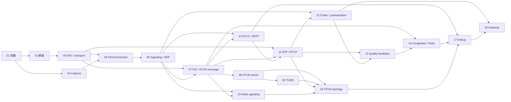

# 《從視訊按鈕到即時連線：高中生也能懂的 WebRTC》全書 Roadmap

> 狀態：使用者於 2026-08-12 核准開始 Chapter 01；Phase 1 第三輪技術審查 `PLAN GATE PASS`。
> 建立日期：2026-08-12。
> 修訂依據：`.work/reviews/plan-technical-r02.md`、前兩輪規劃、`references/original-webrtc-brief.txt` 與 `bible/*.md`。
> 技術狀態唯一基準：`bible/spec-baseline.md`；需求檔不作技術權威。
> 本檔是正式全書規劃；不包含正文、正式圖片或 Lab 實作。

## 一、書名、讀者與核心哲學

### 書名提案

1. **首選：《從視訊按鈕到即時連線：高中生也能懂的 WebRTC》**
   副標題：用故事、瀏覽器實驗與 Debug 建立真正的即時通訊心智模型
2. **《小明、小華，開始連線：用故事與實驗學會 WebRTC》**
3. **《WebRTC 連線偵探：從找路、握手到即時影音》**

### 讀者與完成門檻

- 讀者為 15～18 歲，會使用瀏覽器，最多只懂少量 HTML／JavaScript；不假設 TCP/IP、非同步程式、密碼學、影音編碼或 Linux 管理知識。
- 數學只用比例、速率、時間差與簡單統計。
- 完成後必須能建立兩瀏覽器雙向影音、測試 STUN/TURN、用狀態與 evidence Debug，並完成自產測試源的 RTSP/H.264 → WebRTC → Chrome gateway。

### 核心教學哲學

- 生活問題 → 小明／小華故事 → 讀者猜解法 → 正式名稱 → 真實架構 → 可觀察證據 → 最小程式 → 安全故障 → 復原。
- 比喻每次都附成立與失真邊界；同一概念不換比喻。
- Signaling／媒體、STUN protocol／STUN server、STUN／TURN、NAT／firewall、DTLS／SRTP、codec／packetization 永遠分層表達。
- 正式術語只在指定章首次教學；工具若提前顯示未學欄位，一律遮罩或標「後章解釋」，不得拿它解釋當章概念。
- Debug 先保存成功 baseline，再注入一個故障，依應用 log → state → SDP/candidate → stats → 自產流量 capture 找證據，最後完成復原與恢復驗證。

### 排除範圍

- 不逐條改寫 RFC，不做 API reference，不從零實作 TURN、codec、SFU/MCU 或完整媒體伺服器。
- 不涵蓋 production 身份、授權、擴縮、高可用與秘密管理。
- 不使用未授權網路、設備、攝影機、憑證、媒體或封包；不使用任何另一本 WebRTC 專案的文字、程式或資產。

## 二、共同技術與規範基線

### Web、Runtime 與工具

| 項目 | 規劃基線 | 鎖定規則 |
|---|---|---|
| WebRTC API | W3C Recommendation 2025-03-13 | 章節 scope 記錄採用 URL 與查核日 |
| Media Capture / WebRTC Stats | 章節執行時的 W3C published snapshot | Ch04 鎖 Capture；Ch07 首次教最小 `getStats()` 證據面板，Ch11–13 按已教媒體概念開放欄位，Ch14/17 才教時間序列與跨指標診斷。各 scope 鎖 snapshot URL/date |
| Chrome | Desktop Stable 151 | 每個 Lab 記錄完整 build；UI 不視為跨瀏覽器保證 |
| Node.js | 24 LTS | WebSocket 套件以 `package-lock.json` 鎖定 |
| coturn | **4.17.2** | Lab 10 實作前鎖 image digest；明寫 listeners、relay range、credentials，不依賴 defaults |
| FFmpeg | **8.1.2** | Lab 15 鎖 release signature/checksum；負責測試源與必要轉碼 |
| MediaMTX | **1.20.0** | Lab 15 鎖 checksum/image digest；負責 RTSP 與 WebRTC/WHEP 終止／轉接，不負責轉碼 |
| Wireshark | Ubuntu 24.04 repository 鎖定版 | 只 capture 自產 Lab 流量，不解密媒體 payload |

完整 digest/checksum 必須在首次實作時寫入 Lab lock/evidence；規劃稿不虛構尚未下載驗證的 digest。

### 核心規範狀態摘要

下表直接引用 `bible/spec-baseline.md` 的 2026-08-12 狀態；章節 scope 只擷取實際使用子集，送審時再查核。

| 主題 | 採用規範與 status／更新關係 | 章節 |
|---|---|---:|
| 整體／Web API | RFC 8825 Proposed Standard（Internet Standards Track）；W3C WebRTC REC 2025-03-13 | 01、04–17 |
| NAT／transport | RFC 1918 BCP；2663 Informational；4787 BCP 且被 6888/7857 更新；8085 BCP；9293 Internet Standard | 03、14 |
| JSEP／SDP | RFC 9429 Proposed Standard，obsoletes 8829；RFC 8866 Proposed Standard，obsoletes 4566 | 06、12 |
| ICE／STUN／TURN | RFC 8445 PS，obsoletes 5245；8838 PS；8489 PS，obsoletes 5389；8656 PS，obsoletes 5766 | 07–09、16 |
| 安全 | RFC 5764 PS，被 7983/9443 更新；8827 PS；3711 PS，被 5506/6904/9335 更新；8835 PS | 10、17 |
| 媒體 | RFC 3550 Internet Standard，obsoletes 1889 且被 5506/5761/6051/6222/7022/7160/7164/8083/8108/8860 更新；8834/8835 PS；6184/7741/9628/7742 PS；AV1 RTP spec 鎖 commit/date | 11–13、18 |
| 回饋／壅塞 | RFC 4585 PS，被 5506/8108 更新；5104 PS；**8836 Informational guidance** | 13、14 |
| RTSP | RFC 2326 PS，已被 7826 obsoleted，但用於 RTSP 1.0 部署現況；7826 PS 只作 2.0 對照，不混用行為 | 18 |
| WHEP | 固定 `draft-ietf-wish-whep-03` 2025-08-18 snapshot；已於 2026-02-19 expired/archived，非 RFC；查核日已有後續 revision | 18 僅作 work-in-progress 背景；實際接口依 MediaMTX 1.20.0 implementation behavior |

## 三、6 Parts／18 Chapters 總覽

| Part | Chapters | 學習階段 |
|---|---|---|
| I　按下按鈕以前 | 01–03 | 問題、網路角色、地址、NAT/firewall、transport |
| II　讓瀏覽器準備通話 | 04–06 | 擷取、PeerConnection、offer/answer description；尚不宣稱連線 |
| III　找到路並安全上路 | 07–10 | ICE/STUN message、最小 Stats 證據面板、STUN server、TURN、DTLS-SRTP |
| IV　媒體封包與品質 | 11–14 | RTP/RTCP 欄位、codec/packetization、品質回饋、進階 stats 分析 |
| V　組成可 Debug 的應用 | 15–17 | Node signaling、LAN/模擬 NAT/TURN、受控故障與工具 |
| VI　真正工程師的世界 | 18 | FFmpeg RTSP/H.264 → MediaMTX WebRTC/WHEP → Chrome |

## 四、逐章設計

## Part I　按下按鈕以前

### Chapter 01：為什麼視訊通話不是「把影片寄過去」

- **學習目標：**分辨下載後播放與即時互動；列出擷取、協調、找路、安全、媒體與品質六類問題；知道成功必須有證據。
- **先備章節：**無。
- **首次術語：**即時通訊（real-time communication）、WebRTC、對等端（peer）。
- **技術基線：**W3C WebRTC REC 2025-03-13；RFC 8825 Proposed Standard（Internet Standards Track；applicability statement／規範 roadmap，本身不另行定義 protocol）。
- **生活故事：**小明以為按下按鈕就像寄照片，小華逐一指出雙方仍需準備、協調、找路、安全和處理塞車。
- **比喻成立／失真：**寄送能呈現準備與傳送；但即時媒體不是先完成整個檔案，真實系統也同時運作多條狀態回路。
- **生活故事圖：**「完整檔案寄送」與「邊產生邊互動」兩條時間線。
- **專業圖：**Browser A/B 鳥瞰，只標協調資訊與即時影音兩種線；細部留白。
- **對應 Lab：**無正式 Lab；章內只建立產品觀察清單。
- **Debug 情境：**看到單向畫面是否等於通話成功？
- **章內安全故障／證據／恢復：**在自有測試通話中 mute 本機，不錄影；證據為對端收音現象與產品狀態；unmute 後確認恢復。若環境含他人或非自有帳號即停止。
- **主要第一手來源：**W3C WebRTC；RFC 8825。

### Chapter 02：Client、Server、IP、Port、LAN 與 WAN

- **學習目標：**用地址與服務入口描述通訊；分辨 client/server 是互動角色；畫出 LAN 與 WAN 基本路徑。
- **先備章節：**01。
- **首次術語：**client、server、IP address、port、LAN、WAN、packet。
- **技術基線：**RFC 1122、RFC 8200、IANA port registry；不要求 subnet 計算。
- **生活故事：**寄件需同時知道大樓地址與辦公室入口，校內與跨城道路範圍不同。
- **比喻成立／失真：**地址／入口能對應主機／服務；IP 不永久等於人，port 不是應用本身，路由也不保證最短。
- **生活故事圖：**校內和跨城寄送，分別標地址與入口。
- **專業圖：**兩主機、LAN router、Internet、server；封包分開 IP 與 transport port，不畫 NAT。
- **對應 Lab：**無正式 Lab；只觀察自己開啟頁面的 DevTools request。
- **Debug 情境：**主機可達但服務未監聽。
- **章內安全故障／證據／恢復：**在 localhost 將測試 server 改到另一個非特權 port；證據為舊 URL connection refused 與新 URL 成功；改回原 port 並重測。不得掃描 LAN port。
- **主要第一手來源：**RFC 1122、8200；IANA Service Name and Port Number Registry。

### Chapter 03：NAT、Firewall、UDP 與 TCP

- **學習目標：**分辨 private/public address、NAT mapping 與 firewall policy；比較 UDP/TCP 取捨，不說 UDP 一定更快。
- **先備章節：**02。
- **首次術語：**private/public IP、NAT、mapping、firewall、UDP、TCP。
- **技術基線：**RFC 1918、2663、4787 + updates 6888/7857、8085、9293。
- **生活故事：**總機改寫聯絡方式，警衛另依政策放行；兩者不是同一工作。
- **比喻成立／失真：**總機對應 mapping、警衛對應 policy；實際 NAT 行為依狀態／實作，firewall 也不一定和 NAT 同位置。
- **生活故事圖：**總機與警衛兩個獨立站點，各列做到與做不到。
- **專業圖：**private host、mapping table、firewall policy、public network；另以時間線比較 UDP/TCP 語意。
- **對應 Lab：**無正式 Lab；不改 router/firewall。
- **Debug 情境：**同 LAN 可通、換網路不通，分成地址、mapping、policy 三假設。
- **章內安全故障／證據／恢復：**只在 disposable container network 暫停一個已知 TCP/UDP 測試 listener；證據為該 transport 的明確失敗；重啟 listener 後驗證成功。Host 主網路不可成為目標。
- **主要第一手來源：**`bible/spec-baseline.md` 的 NAT/transport 列。

## Part II　讓瀏覽器準備通話

### Chapter 04：取得攝影機與麥克風

- **學習目標：**安全取得權限；分辨 stream/track；控制 mute/unmute；觀察 constraint/settings；說明 AEC 邊界。
- **先備章節：**01；局部補充必要的 Promise 語法。
- **首次術語：**media capture、`getUserMedia()`、constraints、`MediaStream`、`MediaStreamTrack`、secure context、AEC。
- **技術基線：**執行時 Media Capture published snapshot/date；Chrome 151 完整 build。
- **生活故事：**廣播室先核准器材；推車上有可獨立開關的影像軌與聲音軌。
- **比喻成立／失真：**權限、器材集合、軌道對應 permission/stream/track；stream 不是已壓縮檔，enabled/muted/ended 不同。
- **生活故事圖：**管理員、器材推車、audio/video 兩軌。
- **專業圖：**device → `getUserMedia()` → stream → tracks → `<video>`，分開 requested constraints/actual settings。
- **對應 Lab：**01、02。
- **Debug 情境：**拒絕權限、無裝置、非 secure context、constraint 不滿足。
- **章內安全故障／證據／恢復：**故意拒絕一次權限；證據為例外名稱和無 active track；在站點設定重新允許並驗證 tracks live。全程耳機／低音量，不保存媒體。
- **主要第一手來源：**Media Capture and Streams locked snapshot；相關 WPT。

### Chapter 05：RTCPeerConnection 與連線狀態

- **學習目標：**將 local track 加入 `RTCPeerConnection`；觀察物件建立／關閉；知道它管理多層機制但此章不拆解。
- **先備章節：**03、04。
- **首次術語：**`RTCPeerConnection`、`addTrack()`、`connectionState`、event。
- **技術基線：**W3C WebRTC REC 2025-03-13；不用淘汰 callback API。
- **生活故事：**小明、小華各有通話控制桌，把自己的影音軌交給桌面管理。
- **比喻成立／失真：**控制桌呈現物件與事件；真實物件橫跨後續 ICE/DTLS/SRTP，狀態不是單一路線。
- **生活故事圖：**兩張控制桌接入 tracks，中央路徑仍為問號。
- **專業圖：**track → PeerConnection → sender slot → event listener；**不在正文首次引入 `RTCRtpSender` 名稱**。若 API 輸出顯示該字，整體視為不可拆字的 Web API object label，RTP 子字不得用來解釋，正式延至 Ch11/12。
- **對應 Lab：**03。
- **Debug 情境：**沒有 track、track ended、close 後重用。
- **章內安全故障／證據／恢復：**故意在 `close()` 後再次操作；證據為 state/exception；建立全新物件而非復活舊物件，移除 listeners 後驗證無殘留事件。
- **主要第一手來源：**W3C WebRTC；WebRTC WPT。

### Chapter 06：Signaling、Offer／Answer 與 SDP

- **學習目標：**說明 signaling 由應用選擇且不承載媒體；只完成 offer/answer 與 description state；閱讀 SDP 中本章允許的會談／媒體描述範圍。
- **先備章節：**05。
- **首次術語：**signaling、signaling server、offer/answer、SDP、JSEP、local/remote description、signaling state、控制訊息流、媒體資料流。
- **技術基線：**RFC 9429（obsoletes 8829）、RFC 8866（obsoletes 4566）、W3C WebRTC。
- **生活故事：**介紹人只交換能力履歷，不搬運影音包裹。
- **比喻成立／失真：**呈現應用交換與描述；signaling transport 不由 WebRTC 規定，SDP 有嚴格語法且不会自己送達。
- **生活故事圖：**介紹人交換履歷；媒體路徑以「尚未建立」問號表示。
- **專業圖：**`createOffer` → `setLocalDescription` → 手動傳遞 → `setRemoteDescription` → answer 的 description-state 時序；**不畫成功媒體路徑、不交換 candidate、不顯示 selected pair**。
- **對應 Lab：****Lab 04 只做 description state，不完成通話。**允許解讀 `v=`, `o=`, `s=`, `t=`, `m=` 的會談／媒體區段與 `a=sendrecv|sendonly|recvonly|inactive` 方向；`a=ice-*`, `a=candidate`, `a=fingerprint`, `a=setup`, `a=rtpmap`, `a=fmtp`, payload type 等遮罩並標「Ch07/10/12 解釋」，不得提交真實 IP/credential。
- **Debug 情境：**錯 description 順序、把 signaling 成功誤認為連線成功。
- **章內安全故障／證據／恢復：**故意在錯誤 signaling state 設定 answer；證據為 state 與標準例外；關閉兩端、重建並依正確順序重跑至 stable，仍不宣稱媒體已通。
- **主要第一手來源：**RFC 9429、8866；W3C WebRTC。

## Part III　找到路並安全上路

### Chapter 07：ICE Candidate、Connectivity Check 與最小證據面板

- **學習目標：**把 candidate 當可能的 transport address；形成 pair/checklist，執行 check/nomination；分辨 ICE check 使用的 STUN protocol message 與下一章外部 STUN server；第一次用唯讀 Stats snapshot 找到 selected candidate pair 與 transport/candidate 關聯。
- **先備章節：**03、06。
- **首次術語：**ICE、ICE candidate、host candidate、candidate pair、checklist、nomination、Trickle ICE、ICE states；**STUN protocol message／Binding transaction（只限 ICE connectivity check 的封包格式，不含 STUN server address discovery）**；`getStats()`、`RTCStatsReport`、Stats snapshot、`transport`／`candidate-pair`／local/remote candidate record。
- **技術基線：**RFC 8445、8838、8489；W3C WebRTC REC；本章 scope 鎖定 WebRTC Stats published snapshot URL/date 與 Chrome 151 完整 build。
- **生活故事：**雙方把聯絡方式配對，試路小隊用標準格式逐組確認並選路。
- **比喻成立／失真：**清單／配對／試路對應 gather/pair/check；candidate 非完整路線，check 非 ICMP ping，優先序與 nomination 有正式規則。
- **生活故事圖：**兩清單形成 pairs，試路後圈 selected pair。
- **專業圖：**candidate → pairs → checklist → **peer-to-peer STUN connectivity-check messages** → nominated pair；另畫最小唯讀 evidence chain：`RTCStatsReport` 的 `transport.selectedCandidatePairId` → `candidate-pair` → local/remote candidate。畫面註記「沒有外部 STUN server」。
- **對應 Lab：**Lab 05「同頁兩 Peer 加入 candidate 交換後才完成連線」；Lab 06「暫停／恢復 Trickle ICE」。Lab 05 首次使用 `getStats()`，只讀 `type/id`、selected pair 關聯、candidate type/protocol 與 transport；candidate address 一律遮罩；不讀 RTP、codec、bytes、packets、loss、jitter、RTT 或 bitrate。
- **Debug 情境：**不交換 candidate、只交換單側、候選佇列亂序或無界。
- **章內安全故障／證據／恢復：**停止 candidate forwarding；證據為 gathering 完成但無 usable pair／ICE 未連線；補送受控佇列或重建 peers，以最小 Stats evidence chain 確認 selected pair，並以雙端 `ontrack`、remote track `readyState=live` 與可見/可聽自產媒體確認恢復，不使用尚未教的 RTP counters。
- **主要第一手來源：**RFC 8445、8838、8489；W3C WebRTC；本章鎖定的 W3C WebRTC Stats snapshot。

### Chapter 08：STUN Server、Mapped Address 與 Server-reflexive Candidate

- **學習目標：**說明 STUN server 的 Binding discovery 如何從模擬外側觀察 mapped address；分辨 host/srflx；知道 STUN 不 relay、不保證穿越。
- **先備章節：**03、07。
- **首次術語：****STUN server**、mapped address、server-reflexive candidate（srflx）、STUN URI。STUN protocol message 已在 Ch07 教過，本章新增的是 server role/discovery usage。
- **技術基線：**RFC 8489、8445。
- **生活故事：**小明向外部地址詢問站詢問「你看到我從哪裡來」，詢問站只回答地址、不搬包裹。
- **比喻成立／失真：**外部觀察對應 mapped address；回覆非永久公開地址，也不建立任意 inbound 通道。
- **生活故事圖：**社區內端點詢問模擬外側 server，回傳外界視角地址。
- **專業圖：**inside namespace → NAT → outside STUN server → srflx → ICE pair；address discovery 與 peer check 畫成兩個 transaction。
- **對應 Lab：**概念章內先解讀；正式可重現拓撲固定為 Lab 09（Ch16 執行）。
- **Debug 情境：**無 srflx、得到 srflx 仍不通、把 response 當媒體路徑。
- **章內安全故障／證據／恢復：**在 disposable namespace 將 STUN URI 改到不存在 listener；證據為無 srflx 但 host candidate 仍存在；恢復正確 URI 後驗證 mapped address 與 srflx 重現。
- **主要第一手來源：**RFC 8489、8445。

### Chapter 09：TURN、Relay Candidate 與 coturn

- **學習目標：**說明 TURN allocation/permission/relay；分辨 TURN、STUN server、signaling；理解 relay 的延遲、頻寬、成本與 credential 邊界；分開辨識 selected relay candidate 與 client-to-TURN 使用的 protocol。
- **先備章節：**07、08。
- **首次術語：**TURN、TURN server、allocation、permission、relay candidate、coturn、`iceTransportPolicy: "relay"`；local-candidate Stats 的 `candidateType=relay` 與 `relayProtocol`（只描述 client-to-TURN protocol，不等於 selected pair 的傳輸協定）。
- **技術基線：**RFC 8656；coturn 4.17.2，實作鎖 digest；沿用 Ch07 鎖定 Stats snapshot並在 scope 確認 `relayProtocol` 支援；不依賴 4.17.x listener defaults。
- **生活故事：**直連不可行時，雙方經物流中心轉送包裹。
- **比喻成立／失真：**第三方轉送與成本相符；TURN 不解碼媒體、不交換 SDP，也非必經路。
- **生活故事圖：**直達失敗後才選 relay，signaling 另線。
- **專業圖：**allocation、permission、relay address、client-to-TURN transport 與 TURN-to-peer relay leg；listener/relay port range 清楚分開，旁附 selected pair → local candidate (`candidateType=relay`) → `relayProtocol` 的證據鏈。
- **對應 Lab：**正式部署固定 Lab 10（Ch16 執行）。
- **Debug 情境：**錯 credential、listener/relay port 未映射、relay 存在但未選。
- **章內安全故障／證據／恢復：**用短效假密碼故意 authentication fail；證據為 coturn auth log 與無 relay candidate；恢復正確短效 credential 後驗證 selected relay pair，再撤銷 credential。
- **主要第一手來源：**RFC 8656；coturn 4.17.2 官方 release/docs。

### Chapter 10：DTLS、Fingerprint、SRTP 與安全邊界

- **學習目標：**按 ICE 選路 → DTLS handshake/fingerprint → SRTP/SRTCP protection 排序；分辨 HTTPS、DTLS、SRTP 與應用身份。
- **先備章節：**06、07、09。
- **首次術語：**DTLS、certificate fingerprint、DTLS handshake、SRTP、SRTCP、DTLS-SRTP keying。
- **技術基線：**RFC 5764 + updates 7983/9443、8827、8835、3711。
- **生活故事：**先核對握手指紋，再取得本次通話防拆封條。
- **比喻成立／失真：**握手／封條對應 keying/protection；fingerprint 信任仍依 signaling，SRTP 不等於身份，DTLS 不承載一般媒體。
- **生活故事圖：**試路 → 握手 → 受保護包裹三階段。
- **專業圖：**selected pair → DTLS → SRTP/SRTCP；HTTPS signaling 在獨立 trust boundary。
- **對應 Lab：**正式 evidence 併入 Lab 11，僅觀察 encrypted flow 與 stats。
- **Debug 情境：**ICE 成功但 DTLS 失敗、fingerprint 不一致。
- **章內安全故障／證據／恢復：**在 disposable peers 建立不一致 fingerprint/description 測試；證據為 ICE 可用但 DTLS/connection 失敗；丟棄被改動 description，從乾淨 offer/answer 重建並驗證 connected。不得弱化安全設定求成功。
- **主要第一手來源：**`bible/spec-baseline.md` 安全列。

## Part IV　媒體封包與品質

### Chapter 11：RTP、RTCP 與受保護媒體流

- **學習目標：**分辨 RTP media 與 RTCP feedback/sync；理解 sequence/timestamp/SSRC；知道 RTP 不保證送達；把 Ch07 的最小 Stats 面板擴充至 inbound/outbound RTP 基本傳輸 counters，以交叉佐證 encrypted media flow。
- **先備章節：**03、07、10。
- **首次術語：**RTP、RTCP、sequence number、RTP timestamp、SSRC、sender/receiver report；`inbound-rtp`／`outbound-rtp` Stats record 與 `bytesReceived/bytesSent`、`packetsReceived/packetsSent` 基本 counters。此處才拆解 Ch05 API label 中的 RTP 意義。
- **技術基線：**RFC 3550（含 `bible/spec-baseline.md` 所列 updates）、8834、3711（含 updates）；沿用 Ch07 鎖定的 Stats snapshot 並在本章 scope 重查；不提前教 codec、packetization、loss/jitter 或 bitrate 分析。
- **生活故事：**已準備好的媒體單元被裝成帶序號與時間標記的包裹，另有週期性回報。
- **比喻成立／失真：**包裹／回報呈現 data/control 分工；timestamp 非牆鐘、sequence 會回繞、RTCP 非逐包送達保證。
- **生活故事圖：**已備妥內容 → 編號包裹與週期回條；內容如何製成留作黑盒。
- **專業圖：****從「已編碼 media unit（Ch12 解釋）」黑盒開始** → RTP/SRTP transport → 「接收處理（Ch13 解釋）」黑盒；不出現 encode、codec、packetization、jitter/decode 流程。
- **對應 Lab：**Lab 11 於 Ch17 執行；只觀察 DTLS handshake、SRTP/SRTCP flow 特徵、五元組與本章已教的 inbound/outbound bytes/packets，且用 Ch07 的 selected-pair chain 對齊五元組；不解密 payload、不以 Wireshark label 單獨證明內容。
- **Debug 情境：**有 encrypted packets 但 inbound stats 不成長；RTCP report 顯示異常。
- **章內安全故障／證據／恢復：**只在自產媒體 session 暫停 sending track；以間隔兩次 snapshot 確認 outbound/inbound bytes 不再增長而 signaling/ICE 保持；恢復 track 後確認 counters 再增長。此處只做兩次 snapshot 差值，不教長時間序列或品質因果；capture 只限 Lab 五元組。
- **主要第一手來源：**RFC 3550、8834、3711。

### Chapter 12：Codec、VP8／VP9／H.264／AV1 與 Packetization

- **學習目標：**分辨 raw media、codec bitstream 與 RTP packetization；把 Stats 面板新增 `codec` record 與 RTP record 的 `codecId` 關聯，從 capability、SDP 與 runtime evidence 三方確認實際 codec。
- **先備章節：**06、11。
- **首次術語：**codec、encode/decode、bitstream、payload type、RTP payload format、packetization、VP8/VP9/H.264/AV1、profile/level；Stats `codec` record、`codecId` 與 `mimeType`。
- **技術基線：**RFC 7741、9628、6184、**RFC 7742 Proposed Standard**；AV1 RTP spec 在 scope 鎖 commit/date；沿用並重查 Ch07 的 Stats snapshot；runtime Chrome capability。
- **生活故事：**先選共同語言，再決定如何把內容切成運輸小包。
- **比喻成立／失真：**語言對應 codec，切包對應 packetization；同為 H.264 仍可能因 profile/level/packetization-mode 不互通。
- **生活故事圖：**內容 → 共同語言 → 切包，另示同語言不同規則失敗。
- **專業圖：**raw frame → encode → bitstream → codec-specific RTP payload → packet；capability/preference/selected codec 對照。
- **對應 Lab：**Lab 12 於 Ch17 執行。
- **Debug 情境：**SDP 有 codec 但沒被選、profile mismatch、repacketize 誤稱 transcode。
- **章內安全故障／證據／恢復：**在兩端 capability 交集內先建立 baseline，再設定無共同 preference 的 disposable session；證據為協商/媒體結果，以及 `inbound/outbound-rtp.codecId → codec.mimeType`；還原 preference 並重建，確認 codec record 回到 baseline。
- **主要第一手來源：**`bible/spec-baseline.md` 媒體列；AV1 鎖定 snapshot。

### Chapter 13：Latency、Jitter、Jitter Buffer、Loss、NACK／PLI／FIR

- **學習目標：**分辨 latency/jitter/loss；解釋 buffer 取捨；說明 NACK/PLI/FIR 不同用途；把 Stats 面板新增當章品質欄位，但不做跨指標壅塞因果推論。
- **先備章節：**11、12。
- **首次術語：**latency、jitter、jitter buffer、packet loss、NACK、PLI、FIR、key frame；當版已實測的 `packetsLost`、`jitter`、NACK/PLI/FIR count 類 Stats 欄位。
- **技術基線：**RFC 3550（完整 updates 見 baseline）、RFC 4585（被 5506/8108 更新）、RFC 5104；本章 scope 重查 Stats snapshot 欄位；不聲稱瀏覽器用相同 buffer 演算法。
- **生活故事：**不規則到達的校車經等待區平順發車；遺失小件與參考鏈斷裂使用不同求援。
- **比喻成立／失真：**到達變化／緩衝／回復請求相符；媒體有 deadline，太晚重傳無價值，PLI/FIR 不保證立即 key frame。
- **生活故事圖：**arrival timeline、等待區、遺失／過晚結果。
- **專業圖：**補全 capture → encode/packetize（引用 Ch12）→ network → jitter buffer → decode/render 與 RTCP feedback。
- **對應 Lab：**Lab 13 於 Ch17 執行。
- **Debug 情境：**低平均 latency 但高 jitter、零 loss 仍卡頓。
- **章內安全故障／證據／恢復：**在 disposable data path 注入短時 fixed delay；證據為規則設定、故障前後兩次 snapshot 的當章品質欄位與可見症狀；到達 timebox 自動移除規則，重跑 baseline 確認數值回復。多點時間序列與因果分析留給 Ch14；Host 主介面禁止。
- **主要第一手來源：**RFC 3550、4585、5104。

### Chapter 14：Congestion Control、Bitrate 與進階 WebRTC Stats

- **學習目標：**分辨 bitrate/capacity/throughput；把 Ch07/11/12/13 已教的 Stats records 組成多點時間序列；用 selected pair、RTP、codec、loss、jitter、RTT、frames、quality limitation 建跨物件 evidence chain 與有限因果推論。
- **先備章節：**07、11、13。
- **首次術語：**congestion control、bitrate、RTT、bandwidth estimation、Stats 時間序列、counter delta/rate、跨 record correlation、quality limitation reason。`getStats()`／`RTCStatsReport` 已於 Ch07 首次教授，不在此重設首次位置。
- **技術基線：****RFC 8836 Informational guidance**、RFC 8085；WebRTC Stats scope 重新鎖 published snapshot/date；欄位需 Chrome 實測，不把 RFC 8836 表述成 Standards Track requirement。
- **生活故事：**觀察員綜合往返、遺失與通行量，逐步調整出貨量。
- **比喻成立／失真：**多訊號 feedback loop 相符；bitrate 下降也可能是 CPU 或應用限制，相關不等於因果。
- **生活故事圖：**三儀表與隨時間調整的出貨節奏。
- **專業圖：**sender → network → receiver feedback → controller → target bitrate；stats object 關聯。
- **對應 Lab：**Lab 13 故障前後建立 stats 時間序列。
- **Debug 情境：**bitrate 降低源自 loss、RTT、CPU 或限制？
- **章內安全故障／證據／恢復：**在 disposable session 暫時限制 sender bitrate；證據為設定、outbound stats 與畫質；移除限制、重建 sender 必要時重建 peer，驗證 bitrate/frames 回到 baseline 範圍。
- **主要第一手來源：**RFC 8836、8085；locked WebRTC Stats snapshot。

## Part V　組成可 Debug 的應用

### Chapter 15：Node.js Signaling Server 與兩個瀏覽器

- **學習目標：**用最小 Node WebSocket server 交換 offer/answer/candidate；設計 session/message schema、ordering 與 correlation；確認 server 不承載媒體。
- **先備章節：**06、07。
- **首次術語：**Node.js runtime、WebSocket、signaling message、session/room id、JSON envelope、correlation id。
- **技術基線：**Node 24 LTS；WHATWG WebSockets；套件 lockfile。
- **生活故事：**介紹人按房號轉交有編號信封；影音走另一條路。
- **比喻成立／失真：**routing/traceability 相符；WebSocket 只是本書選擇，不是 WebRTC wire protocol，教學 server 非 production。
- **生活故事圖：**兩房間、介紹人、編號信封與獨立媒體線。
- **專業圖：**WebSocket signaling 與 WebRTC media path 分離；join/offer/answer/candidate/hangup 時序。
- **對應 Lab：**Lab 07「跨分頁 signaling」。
- **Debug 情境：**錯 room、answer 早到、candidate 屬於舊 session、重連殘留。
- **章內安全故障／證據／恢復：**故意送未知 message type／錯 session；server 拒絕且不轉發，證據為 correlation log；清空 session/reconnect，驗證合法訊息與媒體恢復。Log 遮罩 SDP/candidate 敏感值。
- **主要第一手來源：**WHATWG WebSockets；Node 24 官方 docs；鎖定套件官方 release。

### Chapter 16：從同機、跨 LAN 到模擬 Internet、STUN 與 TURN

- **學習目標：**逐層擴大 topology；辨識 host/srflx/relay selected pair；驗證雙向 audio；知道 LAN/Internet 不決定是否 relay。
- **先備章節：**03、07–09、11、15。
- **首次術語：**deployment topology、ICE restart、TURN credential lifecycle。
- **技術基線：**RFC 8445/8489/8656；coturn 4.17.2 digest；僅自有 LAN 或 disposable VM/namespaces。
- **生活故事：**同桌、同校、跨模擬城市逐層增加一道門，每層保留成功 baseline。
- **比喻成立／失真：**控制變因相符；LAN 未必直連、Internet 未必 TURN，結果由 pair/check/priority 決定。
- **生活故事圖：**三層場景、新增限制與 rollback 點。
- **專業圖：**同機、LAN、namespace NAT、TURN 四 topology；signaling/media 分離，selected pair 明標。
- **對應 Lab：**08「自有 LAN 雙向影音」、09「本機模擬 NAT+STUN」、10「coturn 強制 relay」。Lab 09/10 詳細拓撲見第六節。
- **Debug 情境：**bind/HTTPS/permission、無 srflx、relay port/credential、網路切換。
- **章內安全故障／證據／恢復：**逐層切斷當層唯一測試 route；保存 state/candidate/stats；回到上一層 baseline 或重建 disposable topology，確認雙向 tracks 與 selected pair 恢復。不得改 host 主要網路。
- **主要第一手來源：**RFC 8445、8489、8656；coturn 4.17.2 docs。

### Chapter 17：Console、States、webrtc-internals 與 Wireshark

- **學習目標：**依層縮小故障；安全觀察 encrypted flow；比較 codec；對受控 data path 注入品質與 UDP 故障；完成復原驗證。
- **先備章節：**10–16。
- **首次術語：**DevTools Console、`webrtc-internals`、packet capture、Wireshark、display filter、Debug timeline、baseline/evidence bundle。
- **技術基線：**Chrome 151 完整 build；locked Stats snapshot；Ubuntu 24.04 Wireshark locked package；只 capture 自產流量。
- **生活故事：**偵探依序檢查介紹人、試路、握手、包裹與回報，不先拆所有包裹。
- **比喻成立／失真：**分層證物鏈相符；UI 會改版，encrypted flow 不代表能讀 payload，單一症狀可能多因。
- **生活故事圖：**七檢查站與被 evidence 排除的假設。
- **專業圖：**log/state/SDP-candidate/stats/capture 對應 signaling/ICE/DTLS/SRTP 層。
- **對應 Lab：**11 加密流、12 codec、13 netns/VM netem、14 UDP 無 fallback／TURN TCP(TLS) 雙案例。
- **Debug 情境：**四個正式實驗均先假設、timebox、觀察、復原。
- **章內安全故障／證據／恢復：**只對 disposable topology 套用一條規則；證據 bundle 含 before/during/after；用反向命令或 snapshot recreate，重跑 Lab 07 baseline。任何非 Lab 五元組出現即停止並刪 capture。
- **主要第一手來源：**locked WebRTC Stats；Chrome/Chromium 當版 docs/實作；Wireshark User’s Guide。

## Part VI　真正工程師的世界

### Chapter 18：IP Camera、RTSP／RTP、H.264 與 WebRTC Gateway

- **學習目標：**分清 camera/FFmpeg、RTSP/RTP、MediaMTX、WebRTC/WHEP、browser 責任；分辨 repacketize/transcode；完成相容與不相容後轉碼兩案例。
- **先備章節：**06、09–17。
- **首次術語：**IP camera、camera firmware、RTSP、WebRTC gateway、remux/repacketization、transcoding、MediaMTX、FFmpeg、WebRTC-HTTP Egress Protocol（WHEP，work-in-progress 名稱，不稱現行 IETF standard）。
- **技術基線：**RFC 2326 已被 7826 obsoleted，僅教現存 RTSP 1.0；不混用 2.0；RFC 6184；FFmpeg 8.1.2；MediaMTX 1.20.0；WHEP 背景固定 `draft-ietf-wish-whep-03`（published 2025-08-18，expired 2026-02-19）snapshot，並在 scope 記錄 2026-08-12 查核日與後續 revision 存在。
- **生活故事：**工廠產出既有包裝，gateway 檢查運輸規則；可相容就轉接，不相容由 FFmpeg 重新製造。
- **比喻成立／失真：**呈現產生、控制、packetization、轉接；真實相容受 profile/B-frame/audio/timestamp 等影響，不能只看 H.264 名稱。
- **生活故事圖：**FFmpeg 工廠 → RTSP 站 → gateway → browser；相容直行、不相容回 FFmpeg transcode。
- **專業圖：****必要固定路徑：FFmpeg 自產源以 RTSP/H.264 publish → MediaMTX 終止 RTSP → MediaMTX 建立 WebRTC PeerConnection 並提供播放頁或 `/{path}/whep` HTTP signaling → Chrome。**不使用 Ch15 Node WebSocket signaling。`/{path}/whep` 是 MediaMTX 1.20.0 官方文件與實測的 implementation behavior，不宣稱是 WHEP I-D 規定的通用 URL 或現行 IETF standard。MediaMTX 做 protocol/RTP 處理但不是 transcoder；不相容 H.264 profile/B-frame/audio 由 FFmpeg ingest 前明示轉碼。
- **對應 Lab：**15，含 (A) baseline/no-B-frame 相容輸入的非轉碼或最小處理案例；(B) 不相容 profile/B-frame/audio 先驗證失敗，再加 FFmpeg transcode 驗證成功。
- **Debug 情境：**RTSP 可讀但 WHEP 不播、codec/profile/packetization/timestamp 不合、誤判 MediaMTX 正在 transcode。
- **章內安全故障／證據／恢復：**使用自產 test pattern 故意輸入不相容 stream；證據包括 FFmpeg encode mode、MediaMTX ingress/egress codec/log、Chrome selected codec/stats；切回相容 baseline 或明示 transcode 後驗證。達 CPU/溫度上限或 port 意外公開即停止；cleanup processes/containers/volumes/ports。
- **主要第一手來源：**`bible/spec-baseline.md` RTSP/Lab 工具/IP Camera interface；RFC 6184；expired `draft-ietf-wish-whep-03` 固定 snapshot；MediaMTX 1.20.0 official WebRTC docs／實測 endpoint；FFmpeg docs。

## 五、無向後依賴圖與首次術語控制

- Ch06/Lab04 只到 description stable；Ch07/Lab05 才加入 candidate、完成 ICE/media，並首次用鎖定 snapshot 的 `getStats()`／`RTCStatsReport` 追蹤 transport → selected candidate pair → candidates。
- Ch07 首次教 STUN **protocol message used by ICE checks**；Ch08 首次教外部 **STUN server used for Binding discovery/srflx**。
- Ch11 從已編碼 media unit 黑盒開始，Ch12 才打開 encode/codec/packetization，Ch13 才補 jitter/decode。
- `RTCRtpSender` 若因 API label 出現，在 Ch05 視為不可拆字 object label；正式 RTP 語意只在 Ch11。
- Ch06 SDP 只讀會談／媒體區段與方向；ICE、fingerprint、payload/codec 欄位遮罩並標後章。
- Stats 欄位依概念逐章解鎖：Ch07 只讀 record/id 與 candidate-pair/transport；Ch11 才讀 RTP bytes/packets；Ch12 才讀 codec relation；Ch13 才讀 loss/jitter/feedback；Ch14 才作時間序列、rate、RTT/bitrate/quality-limitation 與跨物件診斷。

## 六、15 個 Lab 的可驗收設計

每個 Lab 都有獨立的拓撲／權限、成功預期、刻意故障、停止條件、復原、cleanup、恢復驗證；實作時仍須補精確命令與 locked evidence。

| Lab | 執行拓撲／權限 | 成功預期 | 刻意故障 | 停止條件 | 復原 | Cleanup | 恢復驗證 |
|---:|---|---|---|---|---|---|---|
| 01 | 自有 Chrome、localhost/HTTPS、自有 camera | local video、live track、settings | 拒絕 camera permission | 非自有裝置／意外錄製 | 站點設定重新允許 | stop tracks、清 `srcObject` | 再取 track 且 live |
| 02 | 自有 mic、耳機或低音量 | mute/unmute 可見；constraint/settings 記錄；AEC 只受控主觀觀察 | disable audio track | 回授尖叫／不適 | enable track | stop tracks、不保存 audio | track live，兩次 mute/unmute 正常；不以 stats 宣稱 AEC 效果 |
| 03 | Localhost、單一 disposable PC object | 建立/addTrack/close 的 state/event | close 後再操作 | event/timer 無界 | 建立新 PC | 移除 listeners/timers、stop tracks | 新 PC 基線且無舊事件 |
| 04 | 同頁兩 PC，只手動 description；無 candidate forwarding | offer/answer descriptions 到 stable；不宣稱連線 | 錯 signaling state 設 answer | SDP 含不應保存資料 | 關閉重建，依正確順序 | 遮罩 SDP、close PCs/tracks | state stable；仍無 selected pair 要求 |
| 05 | 同頁兩 PC；完整 candidate forwarding；鎖 Ch07 Stats snapshot | ICE connected/completed；`transport.selectedCandidatePairId` 可追到 pair/candidates；雙端 `ontrack` 與 remote tracks live | 完全不轉發 candidate | queue 無界／timeout | 補送受控 queue 或重建 | close PCs/tracks、清 queue | selected pair evidence chain 重現、雙端自產媒體恢復；不使用 RTP counters |
| 06 | 同頁兩 PC；可控 Trickle queue | 暫停時 checking、恢復後連線 | 延遲一側 candidate forwarding | timeout／queue 上限 | 依序 flush queue | 清 queue/timers、close | 重跑 Lab05 baseline |
| 07 | Localhost Node 24 + locked WS、兩分頁 | offer/answer/candidate 按 schema 交換，media 不經 server | 未知 type／錯 room | cross-room leak/crash | 清 session、reconnect | stop Node、close WS/PC/tracks | 合法 session 成功、server media bytes 為零設計證據 |
| 08 | 兩台自有裝置、明確核准 LAN、耳機；先備 Ch11 RTP counters | 雙向 audio/video；兩端 `inbound-rtp`/`outbound-rtp` audio bytes/packets；mute/unmute | 一端 mute audio | 需掃描／改弱安全或 audio feedback | unmute/reconnect | 關服務、tracks/PC、移除暫時規則 | 兩端 audio counters 再增、mute 狀態回復；AEC 只記 settings/主觀現象 |
| 09 | **必要免費拓撲：disposable Ubuntu 24.04 VM 內 inside peer namespace → explicit NAT namespace → outside peer+STUN namespace；只用專用 veth/bridge，非 host 主介面** | host 與 srflx 同時出現；srflx 對應 NAT external address；selected pair/evidence 可重現 | 停止 outside STUN listener／改錯 URI | namespace/interface 身分不符、流量逃出專用 subnet | 重啟 listener、恢復 URI；必要時 snapshot/recreate | 刪 namespaces/veth/NAT rules/STUN process | 重新建立拓撲，srflx mapped address 與 baseline 結果重現；公開 STUN 僅選配且另需核准 |
| 10 | Ubuntu disposable VM/container；coturn 4.17.2 digest；explicit listener/relay address、最小 relay port range、container/VM port mapping、短效假 credential；policy=`relay` | Ch07 evidence chain 證明 selected pair 的 local candidate `candidateType=relay`，且雙向 tracks live | 錯 credential，另關閉一個 relay port mapping | service 意外公開、真實 secret、非規劃 port／費用 | 正確短效 credential、恢復 mappings | stop/remove service、撤銷 credential、刪 volumes/rules | port probe 只對本機核准介面顯示全關；重建後 relay baseline 成功 |
| 11 | 自產 media；只 capture 已知 Lab 五元組；無 promiscuous；先備 Ch07/11 Stats 欄位 | DTLS handshake + SRTP/SRTCP flow 特徵；五元組對齊 selected pair；inbound/outbound bytes/packets 交叉一致 | 暫停 sending track | capture 出現非 Lab 流量／要求解密 payload | resume track | stop capture、刪 raw capture 或只留去識別統計、close | RTP bytes/packets counters 再增；不以 Wireshark label 單獨證明內容 |
| 12 | Disposable session、Chrome runtime capabilities；先備 Ch12 codec relation | capability/SDP/`RTP codecId → codec.mimeType` 三方一致 | 設定無共同 codec preference 的測試 session | browser 不穩或超出 capability | 還原 preferences、重建 | close session、刪去識別前 SDP | codec relation 回 baseline |
| 13 | **Disposable Ubuntu 24.04 VM 或 network namespace；browser/media data path 強制經專用 router namespace veth；只對已核對 ifindex/MAC 的 egress qdisc，需 `CAP_NET_ADMIN`；timebox 自動撤除** | before/during/after stats 對應 delay/loss/jitter 設定，流量計數證明穿越 target interface | 依序注入單一 delay、loss、jitter profile | target 為 host 主介面、route 不經該 veth、CPU/timeout 超限 | `tc qdisc del ... root` 反向命令；失敗則 VM snapshot/namespace recreate | 移除 qdisc/netns/veth/capability container | route/ifindex 再核對；Lab07 baseline、stats 回正常範圍 |
| 14 | Disposable topology；case A 無 TURN TCP/TLS；case B 明確配置 coturn TCP/TLS listener+relay ports；鎖 Stats snapshot；UDP rule 只阻擋 client 的 Lab direct-UDP 五元組，明確允許 client→TURN TCP/TLS 與規劃的 TURN relay legs | **A：無 usable pair，ICE 預期失敗。B：先由 `transport.selectedCandidatePairId` 找 pair，再沿 `localCandidateId` 證明 `candidateType=relay`，並在同一 local-candidate record 證明 `relayProtocol=tcp|tls`；通話成功。Pair 自身的 `protocol` 不用來推論 client-to-TURN transport。**若 locked Chrome 不暴露 `relayProtocol`，替代 evidence 必須同時具備鎖定 TURN URL（`transport=tcp` 或 `turns:`）、coturn TCP/TLS listener/allocation log、只含 Lab 的受限五元組 capture | 套用 timeboxed direct-UDP drop rule | 規則觸及管理連線/host/非 Lab 流量，或誤阻 TURN legs | 原子刪規則；必要時 snapshot recreate | 清 firewall rules、TURN service/credentials/captures | A/B 均回到 UDP baseline；分開保存 selected pair、relay candidate、client-to-TURN protocol 三項 evidence；不宣稱自動 direct TCP |
| 15 | FFmpeg 8.1.2 自產 test pattern → RTSP/H.264 publish → MediaMTX 1.20.0 → WebRTC page 或 `/{path}/whep` → Chrome；全在 localhost/disposable VM，不用 Node signaling | A：baseline/no-B-frame 相容輸入成功，記錄 FFmpeg 是否 encode、MediaMTX ingress/egress codec、Chrome selected codec；B：不相容先失敗，加 FFmpeg explicit transcode 後成功 | 不相容 H.264 profile/B-frame/audio 或 timestamp 案例 | CPU/溫度上限、port 意外公開、非自產源 | 切回相容輸入或加入 FFmpeg transcode；MediaMTX 不宣稱 transcode | stop processes/containers、刪 volumes/credentials/streams、確認 ports 關閉 | 重啟相容 baseline；RTSP ingress、WHEP/頁面、Chrome stats 全部成功 |

## 七、三張覆蓋與相依對照表

### A. 原始需求 → 首次正式教學章

| 原始需求群 | 首次章 | 後續實作／深化 |
|---|---:|---|
| WebRTC 整體問題 | 01 | 全書 |
| Client/server、IP/port、LAN/WAN | 02 | 15–17 |
| Private/public IP、NAT/firewall、UDP/TCP | 03 | 08、09、16、17 |
| getUserMedia、stream/track、AEC、雙向語音 | 04 | Lab02；雙端驗收 Lab08 |
| RTCPeerConnection | 05 | 06–17 |
| Signaling、offer/answer、SDP | 06 | Lab04、07 |
| ICE/candidates/pairs/check/trickle、STUN protocol check message；最小 `getStats()`／selected-pair evidence | 07 | Labs05、06；後章沿用 evidence panel |
| STUN server/srflx | 08 | Lab09 |
| TURN/relay/coturn | 09 | Labs10、14B |
| DTLS/SRTP | 10 | Lab11 |
| RTP/RTCP 與 inbound/outbound RTP 基本 counters | 11 | Labs08、11 |
| Codec、VP8/VP9/H.264/AV1、packetization 與 codec stats relation | 12 | Labs12、15 |
| latency/jitter/buffer/loss/NACK/PLI/FIR 與對應 snapshot 欄位 | 13 | Lab13 |
| congestion/bitrate、Stats 時間序列與跨指標診斷 | 14 | Labs13、14、17 chapter tooling |
| Node signaling／兩 browser | 15 | Lab07 |
| 跨 LAN/STUN/TURN | 16 | Labs08–10 |
| Console/webrtc-internals/Wireshark/故障 Debug | 17 | Labs11–14 |
| Camera/RTSP/H.264/gateway/transcode | 18 | Lab15 |

### B. 首次術語 → 唯一章節

| 章 | 唯一首次術語群 |
|---:|---|
| 01 | real-time communication、WebRTC、peer |
| 02 | client/server、IP、port、LAN/WAN、packet |
| 03 | private/public IP、NAT、mapping、firewall、UDP/TCP |
| 04 | capture、getUserMedia、constraints、stream/track、secure context、AEC |
| 05 | RTCPeerConnection、addTrack、connectionState、event；RTCRtpSender label 不拆解 |
| 06 | signaling、offer/answer、SDP/JSEP、descriptions、signaling state、control/media flow |
| 07 | ICE、candidate/host/pair/checklist/nomination/trickle、ICE states、ICE check 的 STUN protocol message；`getStats()`、`RTCStatsReport`、snapshot、transport/candidate-pair/candidate records |
| 08 | STUN server、mapped address、srflx、STUN URI |
| 09 | TURN server、allocation、permission、relay、coturn、relay-only policy；candidateType=relay 與 `relayProtocol` |
| 10 | DTLS、fingerprint、handshake、SRTP/SRTCP、DTLS-SRTP keying |
| 11 | RTP/RTCP、sequence/timestamp/SSRC、reports；inbound/outbound RTP bytes/packets counters |
| 12 | codec/encode/bitstream/payload type/packetization、VP8/VP9/H.264/AV1/profile/level；codec record/codecId/mimeType |
| 13 | latency/jitter/jitter buffer/loss、NACK/PLI/FIR/key frame；對應已實測 quality snapshot fields |
| 14 | congestion/bitrate/RTT/BWE、Stats time series/counter rate/cross-record correlation/quality limitation；不重複首次教 getStats |
| 15 | Node/WebSocket/signaling envelope/session/correlation |
| 16 | deployment topology、ICE restart、TURN credential lifecycle |
| 17 | webrtc-internals、packet capture、Wireshark、debug timeline/evidence bundle |
| 18 | IP camera/firmware、RTSP、gateway、remux/repacketization/transcoding、MediaMTX/FFmpeg/WHEP |

### C. Lab → 先備章節／baseline

| Lab | 執行章 | 必要先備章節 | 成功 baseline |
|---:|---:|---|---|
| 01 | 04 | 01 | 權限 + live local video |
| 02 | 04 | 01、04 當章前半 | live audio/video tracks、mute round-trip、AEC settings |
| 03 | 05 | 03、04 | disposable PC object state lifecycle |
| 04 | 06 | 05、06 當章 | descriptions stable；無連線主張 |
| 05 | 07 | 03、06、07 當章（含最小 Stats 面板） | candidate exchange、selected-pair evidence chain、雙端 remote tracks live |
| 06 | 07 | Lab05 | Trickle pause/recover |
| 07 | 15 | 06、07 | locked Node WS signaling + media |
| 08 | 16 | 04、07、**11**、15；Lab07 | 核准 LAN 雙向影音、RTP audio counters、mute |
| 09 | 16 | 03、07、08；Lab07 | disposable NAT namespace + outside STUN + srflx |
| 10 | 16 | 07–09；Lab07 | coturn 4.17.2 relay-only selected pair；candidateType=relay |
| 11 | 17 | **07**、10、11；Lab07 | encrypted flow + selected-pair/RTP counters，無 payload decrypt |
| 12 | 17 | **07**、06、11、12；Lab07 | capability/SDP/codec Stats relation |
| 13 | 17 | **07**、13、14；Lab07 | controlled routed netem + advanced before/during/after stats |
| 14 | 17 | **07**、09、10、14、16；Labs07、10 | A ICE fail；B 分別證明 selected pair、relay candidate、relayProtocol TCP/TLS |
| 15 | 18 | 11、12、17、18 當章 | FFmpeg→RTSP→MediaMTX page/WHEP→Chrome；不使用 Node signaling |

三表沒有多重首次位置。Stats observation 的唯一首次位置是 Ch07；Ch11–14 只依當章已教媒體概念逐步開放欄位。任何章內 UI label 若超前出現皆遮罩／標後章，不構成教學依賴。

## 八、圖像、篇幅與最終成果

- **插圖：48 張。**18 章各一張生活圖與專業圖，共 36；另 12 張跨章整合圖。每圖先有目的、必懂事項、元件、箭頭、caption、alt、線型、灰階與授權規格，才製作正式圖。
- **篇幅：約 408 頁。**前言/安全 12、Part I 51、II 64、III 83、IV 80、V 73、VI 27、附錄/索引 18；落在 bible 的 360～420 頁。
- **Lab：15 個。**全新環境依序重跑；每個 evidence 都含版本／digest/checksum、拓撲、before/during/after、cleanup 與恢復驗證。
- **最終成果：**學生能建立雙向影音、分辨關鍵協定責任、部署測試 signaling/STUN/TURN、用多層 evidence Debug、在隔離環境復原故障，並判斷 gateway 的 repacketization/transcoding 邊界。

## 九、全書製作 Roadmap（Phase 1–10）

### Phase 1：課程架構
- 產出本 r03、DAG、三張對照表與 Lab 驗收矩陣；domain-expert 再審，使用者核准後才晉升 `book/plan.md`。

### Phase 2：故事與比喻
- 固定小明／小華與 bible 比喻；逐章建立故事節拍與成立／失真句；新增角色先走 proposal。

### Phase 3：技術內容
- 每章依 scope、14 段正文、structure/body technical hash-bound Gate 推進；術語只在本計畫唯一章首次教學。

### Phase 4：生活插圖
- 先完成規格、caption/alt，再製作生活圖；核對固定角色、比喻與不靠顏色辨識。

### Phase 5：專業架構圖
- 核對 protocol、箭頭、control/media、direct/relay、WebSocket/WHEP 等責任；技術與 accessibility 分別 Gate。

### Phase 6：Lab
- 依第六節建立 15 Lab，鎖依賴與 digest/checksum，補精確 command、輸出、timebox、復原及 cleanup；全新環境重跑。

### Phase 7：Debug 實驗
- 只在 disposable topology 注入 candidate、credential、netem、UDP/codec 故障；先證明反向命令與 snapshot recreate。

### Phase 8：IP Camera 實戰
- 固定 FFmpeg RTSP/H.264 → MediaMTX page/WHEP → Chrome；完成相容、不相容失敗、FFmpeg transcode 後成功三段 evidence。

### Phase 9：技術審查
- 跨章查核 `spec-baseline.md` 狀態、三張對照表、圖/正文/Lab 主張、版本與 hash；特別重查五組易混淆邊界。

### Phase 10：出版整理
- 只彙整 manifest 七 Gate/hashes 完整章節；重跑連結、來源、圖片授權、灰階、code、全新環境 Lab 與 Markdown/DOCX/PDF/EPUB validator。

## 十、Phase 1 核准邊界

- 本輪只核准書名、6 Parts/18 Chapters、首次術語位置、15 Labs、48 圖、約 408 頁及共同技術基線。
- 核准前不寫 Chapter 01、不生圖、不實作 Lab、不修改 `book/plan.md`。
- 若讀者程度、章序、Lab 平台、STUN/TURN topology 或 MediaMTX/WHEP 路徑改變，必須重新做依賴與 domain review。
- 核准後由主代理晉升 plan，再從 Chapter 01 `scope.md` 開始，不跳過逐章 Gate。
